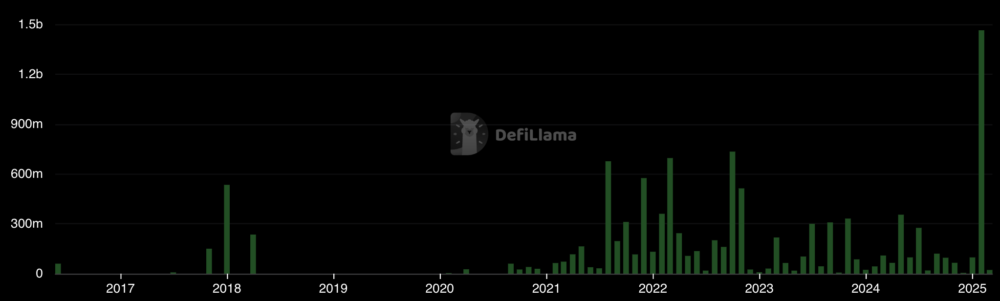

<!-- _class: lead -->

# <!--fit--> DeFi DINOs

## CAS Blockchain und DeFi - FS2025

### Zurich University of Applied Sciences

### Dr. Nils Bundi

<!-- This is presenter note. You can write down notes through HTML comment. -->

---

<!-- _class: lead -->

**Dr. Nils Bundi**

DeFi F&E seit 2017 
Dozent [ZHAW SoE](https://zhaw.ch)
Präsident [DeFi Collective](https://deficollective.org)
DeFi Advisor/Gründer

---

<!-- footer: '_Quelle: [Rekt](https://rekt.news)_' -->

---

# DeFi Exploits (Total inkl. Non-DeFi)

 

<!-- footer: '_Quelle: [Defillama](https://defillama.com)_' -->

---

# Beispiel: Infini Exploit

<!-- footer: '_Quelle: [PeckShield](https://x.com/peckshieldalert/status/1893874770803851454)_' -->

---

<!-- footer: '' -->

---

<!-- This is the slide with custom styling -->

 
 

# Decentralized In Name Only 
# (DINO)

---

# Miss-verständnisse

- Blockchains sind nicht unveränderbar
- Smart Contracts sind nicht unveränderbar (auch nicht smart)
- DeFi Protokolle sind nicht unveränderbar

<!-- footer: '' -->

---

# DeFi Operators

> The Protocol Operators act as a "management team" and implement decisions over the protocol's operations. Their level of control varies widely depending on how the protocol was implemented [...].

<!-- footer: '_Quelle: [EEA Risk Assessment](https://entethalliance.org/specs/defi-risks/#sec-risks-governance)_' -->

---

# Relevanz: MiCA Recital 22

 
 

> Werden Kryptowerte-Dienstleistungen ohne eines Intermediärs in ausschließlich dezentralisierter Weise erbracht, so sollten sie nicht in den Anwendungsbereich dieser
Verordnung fallen.

<!-- footer: '_Quelle: [EUR Lex](https://eur-lex.europa.eu/legal-content/DE/TXT/PDF/?uri=CELEX:32023R1114)_' -->

---

# Zentralisierung in DeFi

<!-- footer: '_Quelle: [Digital Finance Journal](https://link.springer.com/article/10.1007/s42521-023-00088-8)_' -->

---

# Beispiel: Compound-v3

<!-- footer: '_Quelle: [Compound](https://compound.finance)_' -->

---

<!-- footer: '_Quelle: [DeFiScan](https://defiscan.info)_' -->

---

# Wieso Permissions?

- Ship fast, break things
- Anpassen an neue Marktbedingungen
- Pausing im Notfall
- Regulation (?)
- Decentralization is hard! 

<!-- footer: '' -->

---

# Risiken von Permissions

- Hacks (externe Attacker/Blackhats)
- Rug Pulls (interne Attacker/Team)
- Operative Fehler (Governance Risiko)
- Zensur

---

<!-- This is the slide with custom styling -->

 
 
 
 

# How much "De" is in your "Fi"?

---

# www.DeFiScan.info

---

# Decentralization Stages

<!-- footer: '_Quelle: [DeFiScan](https://defiscan.info)_' -->

---

# Decentralization Risk Scoring

<!-- footer: '_Quelle: [DeFiScan](https://defiscan.info)_' -->

---

# Decentralization Stages Scoring

<!-- footer: '_Quelle: [DeFiScan](https://defiscan.info)_' -->

---

# Tooling

**permission-scanner:**

- static SC analyzer
- pulls SC source code from block explorer
- identifies and reports permissions
- supports OZ ACL pattern
- built on Slither

---

# Beispiel Compound ([link](https://www.defiscan.info/protocols/compound-v3))

<!-- footer: '_Quelle: [DeFiScan](https://defiscan.info)_' -->

--- 

# Beispiel Uniswap ([link](https://www.defiscan.info/protocols/uniswap-v3))

<!-- footer: '_Quelle: [DeFiScan](https://defiscan.info)_' -->

---

<!-- This is the slide with custom styling -->

 
 
 

# Thank You!

 [@nilsbundi](https://twitter.com/nilsbundi)  
 [Nils Bundi](https://ch.linkedin.com/in/nils-bundi-6246b998)  
 [@nbundi](https://github.com/nbundi) 

<!-- footer: '' -->
