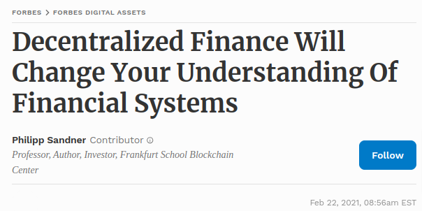
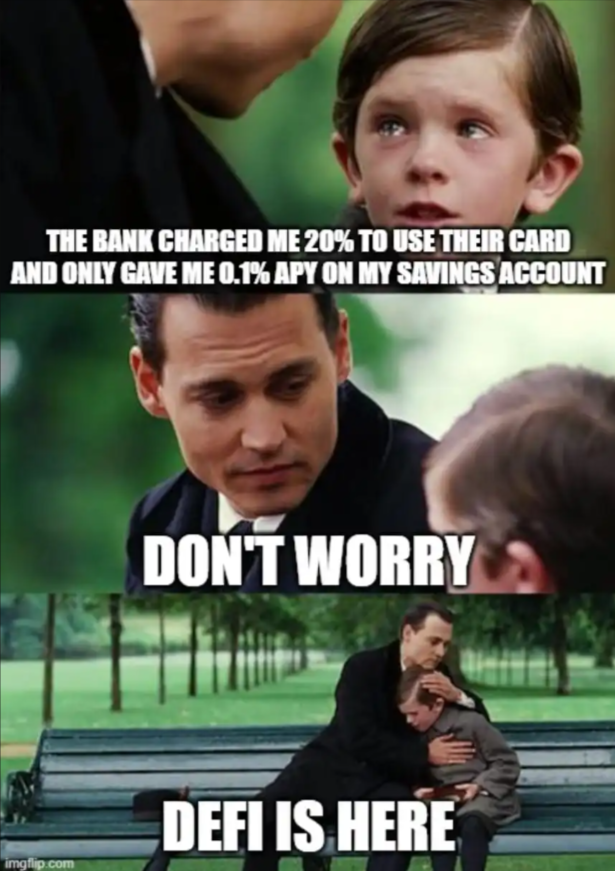
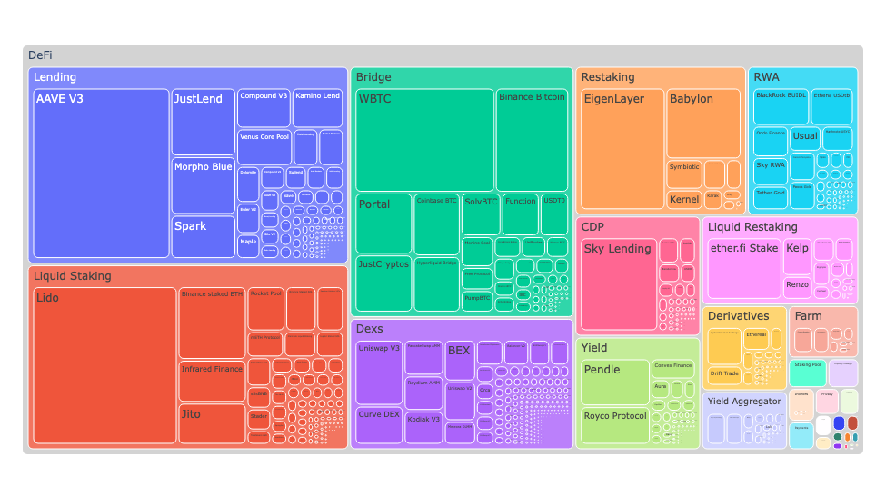
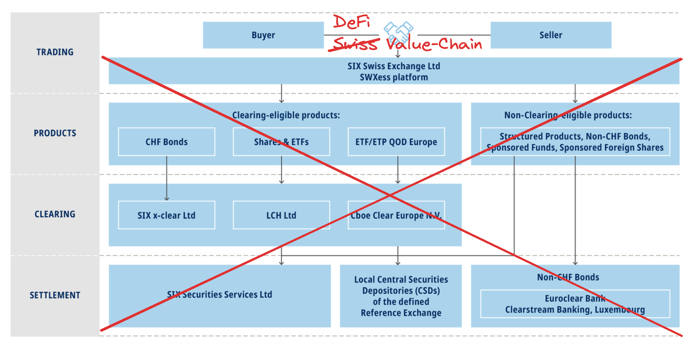
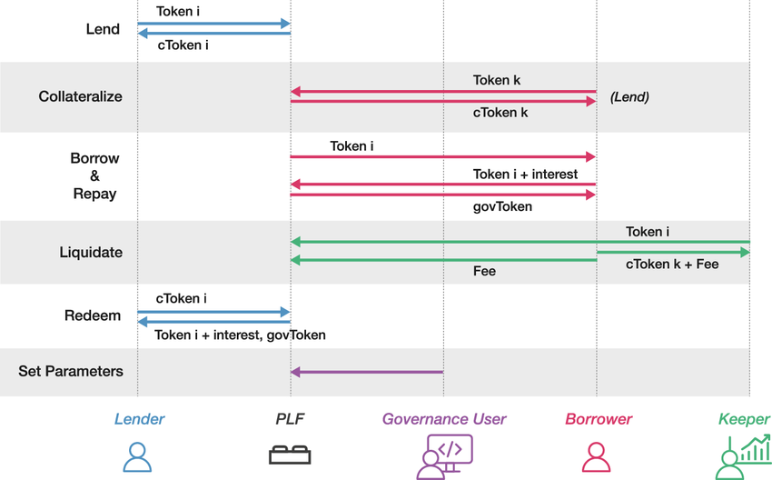
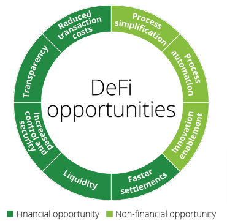
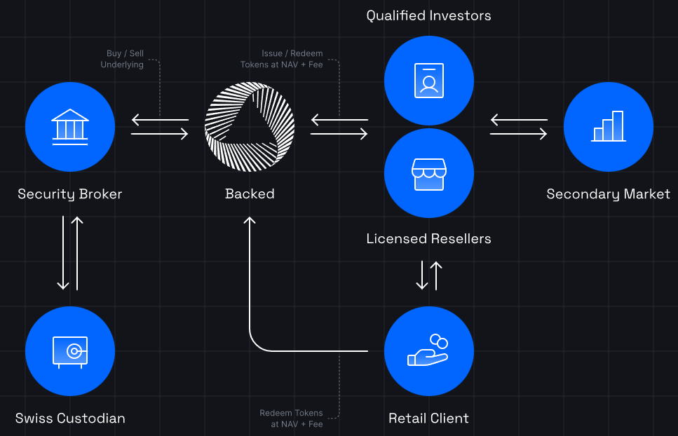

<!-- _class: lead -->

# <!--fit--> DeFi Insights

## CAS Blockchain und DeFi - FS2025

### Zurich University of Applied Sciences
### Dr. Nils Bundi

<!-- This is presenter note. You can write down notes through HTML comment. -->

---

<!-- _class: lead -->

**Dr. Nils Bundi**

DeFi F&E seit 2017 
Dozent [ZHAW SoE](https://zhaw.ch)
Präsident [DeFi Collective](https://deficollective.org)
DeFi Advisor/Gründer

---

# Headlines

---

# DeFi Markt

 
 

| __3541__ Projekte    | __$204B__ TVL       |
| -------------------- | ------------------- |
| __$45B__ 7d-DEX Volume | __>$350m__ 7d-Fees |

<!-- footer: '_Quelle: [Defillama](https://defillama.com)  (March 2025)_' -->

---

# Total Value Locked nach Chain

<!-- footer: '_Quelle: [Ultrasound Labs](https://github.com/ultrasound-labs)_' -->

---

# TVL nach Sektor

<!-- footer: '_Quelle: [Ultrasound Labs](https://github.com/ultrasound-labs)_' -->

---

# Fees nach Sektor

<!-- footer: '_Quelle: [Ultrasound Labs](https://github.com/ultrasound-labs)_' -->

---

# Uniswap

- 2018 gegründet
- Trading von Kryptoassets ($2.8b 24h Volume)
- Keine Finanzintermediäre (wie Handel, Clearing, Settlement, Custody)
- Global, offen, transparent
- 365/7/24 in Betrieb
- https://app.uniswap.org

<!-- footer: '' -->

---

# Uniswap Monthly Fees ([link](https://defillama.com/protocol/uniswap))

<!-- footer: '_Quelle: [Defillama](https://defillama.com)_' -->

---

# FINMA zu DeFi

> [...] Gemeinsam ist DeFi-Projekten insbesondere, dass sie __zugangsoffene Blockchain-Infrastrukturen__ wie Ethereum oder Solana verwenden, um __Finanztransaktionen__ weitestgehend automatisiert und __ohne Beteiligung traditioneller Finanzintermediäre__ abzuwickeln. [...] Die Nutzung steht in der Regel allen offen.

<!-- footer: '_Quelle: [FINMA](https://www.finma.ch/de/dokumentation/dossier/dossier-fintech/decentralized-finance-defi-2022/)_' -->

---

# 1) Zugangsoffene Blockchain

|                 | Offen               | Permissioned      |
| --------------- | ------------------- | ----------------- |
| Lesen           | Öffentlich          | Öffentlich/zustimmung    |
| Schreiben       | Öffentlich          | Öffentlich/zustimmung    |
| Consensus       | Öffentlich          | Zustimmung        |
| Architektur     | Dezentral           | Teilweise dezentral    |
| Zensur          | Unmöglich           | Möglich           |
| Beispiele       | Bitcoin, Ethereum   | Corda, Hyperledger, etc. |

<!-- footer: "" -->

---

# 2) Finanztransaktionen

- Asset issuance / Tokenization
- (Cross Border) Payments
- Trading
- Lending / Private Debt
- Foreign Exchange
- Derivatives
- etc.

---

# 3) Keine trad. Finanzintermediäre

<!-- footer: '_Quelle: Basierend auf [SIX](https://www.six-group.com/en/products-services/the-swiss-stock-exchange/trading/trading-provisions/clearing-and-settlement.html)_' -->

---

# Beispiel Payments

 

<!-- footer: '' -->

---

# Beispiel Trading

<!-- footer: '_Quelle: [Digital Finance Journal](https://link.springer.com/article/10.1007/s42521-023-00088-8)_' -->

---

# Beispiel Lending

---

# Peer-to-Pool

- P2P matching ist ineffizient (Coincidents of Wants)
- Pooling von Liquidität mittels DeFi Protokol
- DeFi Catalyst
- LPs: stellen Liquidität zur Verfügung
- Nutzer: trade, borrow, etc
- Weitere Rollen?

---

# Vorteile

- Settlement: von 3d zu <1h
- Transaktionskosten: sub-Cent für internationale Zahlung
- Effizienz und Automation: 365/7/24
- Innovation: neue Geschäftsmodelle, Finanz-primitive (flash loans), etc

<!-- footer: '_Quelle: [Deloite](https://www2.deloitte.com/content/dam/Deloitte/us/Documents/risk/us-financial-advisory-defi-march-2022.pdf)_' -->

---

# Risiken

- Technologie: immer noch relativ jung
- Security: Phishing, Fraud, DNS hijacking, etc
- Legal: unsicherheit bzgl Regulation auch als Nutzer
- Markt, Liquidität, Gegenpartei

<!-- footer: "" -->

--- 

# Differenzierung

|                     | Traditional Finance | DeFi              |
| ------------------- | ------------------- | ----------------- |
| Custody          | Intermediär  | Nutzer          |
| Execution        | Intermediär  | Smart Contract  |
| Clearing         | Intermediär  | Blockchain      |  
| Settlement       | 2-5 business days | Sekunden bis Stunden |
| Auditierbarkeit  | Limitiert         | Öffentlich |
| Verfügbarkeit   | 9-5/Mo-Fri/252    | 24/7/365   |
| Zugang           | Lokal             | Global     |
| Kosten           | Höher             | Tiefer     |
| Rechtssicherheit | Je nach Herkunft  | Limitiert  |

<!-- footer: "" -->

---

# DeFi Frontiers: Multi-Chain

<!-- footer: '_Source: [L2Beat](https://l2beat.com/scaling/summary)_' -->

---

# DeFi Frontiers: Multi-Chain

<!-- footer: '_Source: [Jumper](https://jumper.exchange)_' -->

---

# DeFi Frontiers: Payments

<!-- footer: '_Quelle: Basierend auf [Fintech Times](https://thefintechtimes.com/cross-border-payments/)_' -->

---

# DeFi Frontiers: Real-World Assets

<!-- footer: '_Source: [Steakhouse Financial](https://dune.com/steakhouse/tokenized-securities)_' -->

---

# DeFi Frontiers: RWAs (cont.)

<!-- footer: '_Source: [Steakhouse Financial](https://dune.com/steakhouse/tokenized-securities)_' -->

---

# DeFi Frontiers: RWAs

<!-- footer: '_Source: [Backed](https://assets.backed.fi/structure)_' -->

---

# DeFi Frontiers: BTCfi

- Bitcoin MCAP >$1.6T
- Bitcoin Dominanz >60%
- Bis 30M User self-custody
- Bis 97M User auf CEX
- 11% Krypto Holder nutzen Payments
- Untapped Markt

<!-- footer: '_Source: [River Research](https://river.com/learn/files/river-bitcoin-adoption-report-2025.pdf)_' -->

---

# DeFi Frontiers: BTCfi

<!-- footer: '_Source: [Coinbase](https://www.coinbase.com/loans)_' -->

---

<!-- This is the slide with custom styling -->

 
 
 

# Thank You!

 [@nilsbundi](https://twitter.com/nilsbundi)  
 [Nils Bundi](https://ch.linkedin.com/in/nils-bundi-6246b998)  
 [@nbundi](https://github.com/nbundi) 

<!-- footer: '' -->