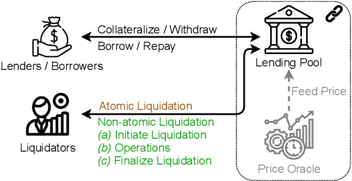
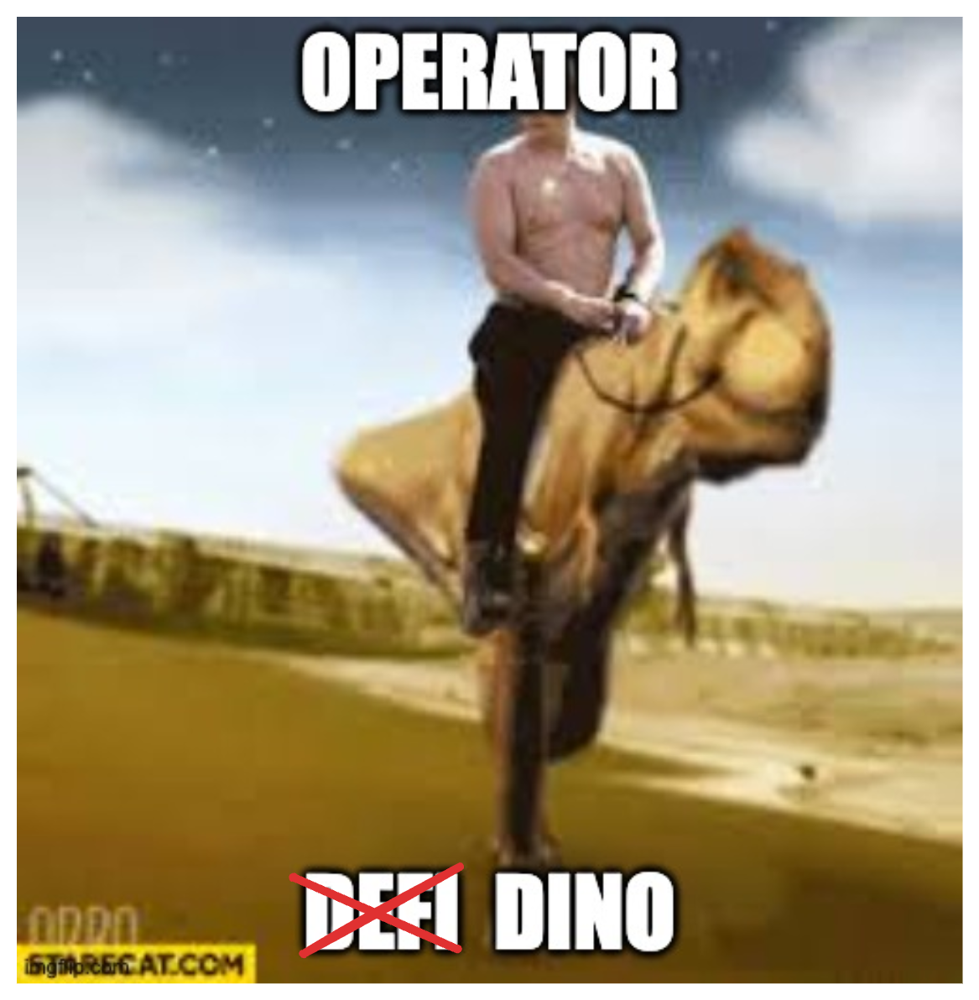
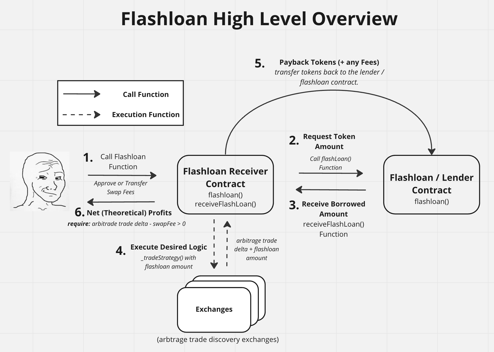

<!-- _class: lead -->

# <!--fit--> DeFi Lending & Borrowing

## CAS Blockchain und DeFi - FS2025

### Zurich University of Applied Sciences
### Dr. Nils Bundi

<!-- This is presenter note. You can write down notes through HTML comment. -->

---

<!-- _class: lead -->

**Dr. Nils Bundi**

DeFi F&E seit 2017 
Dozent [ZHAW SoE](https://zhaw.ch)
Präsident [DeFi Collective](https://deficollective.org)
DeFi Advisor/Gründer

---

# Programm

1. [Einführung](#einführung)
2. [DeFi Kredite](#besicherte-kredite)
4. [Liquidationen](#liquidationen)
3. [Preis Oracles](#preis-oracles)
4. [Governance](#governance)
6. [Flash Loans](#flash-loans)
7. [Alternative Modelle](#alternative-modelle)
8. [Praktischer Teil](#praktischer-teil)

---

<!-- _class: lead -->

# <!--fit--> Einführung

---

<!-- footer: '_Quelle: [Coinbase](https://www.coinbase.com/loans)_' -->

---

<!-- footer: '_Quelle: [Morpho](https://www.morpho.org)_' -->

---

<!-- footer: '' -->

---

# TVL in DeFi Lending

<!-- footer: '_Quelle: [Defillama](https://defillama.com/categories) (März 2025)_' -->

---

# Grösster DeFi Sektor (nach TVL)

<!-- footer: '_Source: [Ultrasound Labs](https://ultrasound-labs.github.com/defi-ecosystem-map)_' -->

---

# Leader: Aave

- 2017 gegründet
- Lending von Kryptoassets
- Total deposits $29B, borrowed $10B
- Fees 30d $30M 
- Avg. stablecoin yield 6.5%
- Global, offen, transparent
- 365/7/24 in Betrieb

<!-- footer: '' -->

--- 

# Aave Märkte

<!-- footer: '_Quelle: [Aave App](https://app-aave-com.ipns.dweb.link) (März 2025)_' -->

---

# Transparenz: Ausstehende Coinbase-Morpho Kredite

<!-- footer: '_Quelle: [Dune](https://dune.com/rudexxx/cbbtc-usdc-morpho-blue-base)_' -->

---

# Transparenz: Coinbase-Morpho Marktrisiko

<!-- footer: '_Quelle: [Dune](https://dune.com/morpho/coinbase-on-chain-loan-positions-liquidations-dashboard)_' -->

---

# Trend: Wallet oder Banking-App?

<!-- footer: '_Quelle: [Argent](https://argent.xyz)_' -->

---

# Use Cases

- "Cover expenses without selling your Bitcoin" (siehe Coinbase-Morpho)
- Grundsätzlich Liquidität auf Kryptoassets
- Verschiedene Finanzstrategien (FX, Basis Trade, Long/Short, etc)
- Finanzierung von Arbitrage und MEV Strategien
- DeFi Strategien (bspw. "Airdrop Farming")
- etc.

---

# Abgrenzung DeFi vs. TradFi/CeFi

|                 | TradFi/CeFi         | DeFi      |
| --------------- | ------------------- | ----------------- |
| Custody         | Intermediär         | Smart Contract    |
| Ledger/Settlement | Intermediär       | Öffentliche Blockchain |    
| KYC             | Ja                  | Nein (Anonym)     |
| Besicherung     | Teilweise           | Ja (>100%)        |
| Laufzeit        | Fix                 | Offen             |
| Zins            | Fix/variabel        | Variabel          |
| Zugang          | 9-5/Mo-Fri/252      | 24/7/365          |
| Vertrieb        | Lokal               | Global            |
| Risiko          | Gegenpartei, etc.   | Technisch, etc.   |

<!-- footer: '' -->

---

<!-- This is the slide with custom styling -->

 

# How tf funktioniert "Anonymes Lending & Borrowing"?

<!-- footer: '' -->

---

<!-- _class: lead -->

# <!--fit--> DeFi Kredite

---

# Ausgangslage

- Offene Infrastruktur (kein KYC)
- Anonyme Teilnehmer
- Keine Intermediäre
- Umsetzung mittels Smart Contracts auf Public BC
- Technische Limitationen (Speicher, Compute, Operationen)

---

# Grundprinzip

- Borrower deposited ein Kryptoasset als Sicherheit
- Solvente Position:
 Assets > Liabilities
- Insolvente Position: 
Assets < Liabilities
- __Es lohnt sich,__ den Kredit zurückzuzahlen, sofern die Position solvent ist

---

# Lenders

- Depositen Liquidität in einen gemeinsamen _Lending Pool_ 
- Verdienen Zins auf Deposit
- Können Liquidität jederzeit abziehen (sofern verfügbar)
- Geschützt durch >100% Besicherung von Krediten

---

# Borrowers

- Depositen _Collateral_ Assets als Sicherheit
- Bezahlen variablen Zins
- Können Kredit jederzeit zurückzahlen
- Müssen Kredit zu >100% besichern
- Werden automatisch _liquidiert_, falls Sicherheit nicht ausreichend

---

# Liquidators

- Externe Teilnehmer
- Monitoren den Lending Markt, um möglichst rasch liquidierbare Positionen zu identifizieren
- Liquidieren insolvente Positionen
- Verdienen Liquidationsgebühr

---

# Oracle Price Feeds

- Externe Infrastruktur
- Informiert Lending Protokoll über den Wert der Collateral und Debt Assets
- Kritische Infrastruktur

---

# Governance

- Kontrolliert kritische Risikoparameter im Markt (bspw. _Liquidation Bonus_, _Liquidation LTV_, etc)
- Verschieden umgesetzt:
-- Team Multisig
-- Security Council
-- Onchain Gov. (DAO)
-- _Immutable_ (No-Gov.)
- __Frage:__ Regulation?

---

# Zinsen

- Was ist der Zins?
- Normalerweise variabel, basierend auf der _Utilization_ für ein Asset
- Utilization = $\frac{\text{"total debt"}}{\text{"total supplied"}}$
- __State-of-the-art:__ Autonome Anpassung an Marktumfeld mittels  _Curve Controller_

<!-- footer: '_Source: [Vesu](https://docs.vesu.xyz/blog/2024-04-03-vesu-lending-hooks)_' -->

---

# Peer-to-pool vs Peer-to-peer

<!-- footer: '_Quelle: [Wintermute](https://www.wintermute.com/insights/research/understanding-aave-governance-v2-the-decision-system-behind-defis-largest-lending-platform)_' -->

---

# Analogie: Securities Lending

<!-- footer: '_Quelle: [Swissquote](https://www.swissquote.com/en-ch/private/trade/products/securities/lending)_' -->

---

<!-- _class: lead -->

# <!--fit--> Liquidationen

<!-- footer: "" -->

---

 

---

# Recap: Wieso Liquidationen?

__Antwort:__ Ohne Liquidationen kein Anreiz für Kreditnehmer, den Kredit zurückzuzahlen.

---

# Liquidations-Kriterium

__Loan-to-value__ (LTV) misst die Solvenz einer Position:

$$
LTV = \frac{\text{Value of Debt}}{\text{Value of Collateral}}
$$

__Health factor__ (HF) misst das Liquidations-Risiko:

$$
HF = \frac{\text{LiquidationLTV}}{\text{LTV}}
$$

__Liquidate__ position if HF<=1!

<!-- footer: "" -->

---

# Beispiel

---

# Liquidatoren

- Öffentlich (jeder kann liquidieren)
- Liquidator schützt Lender
- Liquidator macht Profit
- Sehr kompetitiver Markt dominiert durch MEV-bots
- Kapitalneutral mit Flash Loans (Liquidation von 1M, 10M, 100M position ohne Kapitalaufwand🤯)

<!-- footer: '_Quelle: [Qin et al](https://dl.acm.org/doi/10.1145/3487552.3487811)_' -->

---

# Liquidations-Modelle

<!-- footer: '_Quelle: [Delphi Digital](https://members.delphidigital.io/reports/breaking-down-the-design-space-of-money-market-liquidations)_' -->

---

<!-- _class: lead -->

# <!--fit--> Oracle Price Feeds

---

# ELI5 Oracles

<!-- This is the slide with custom styling -->

 

### Eine verlässliche Quelle für externe (Preis-) Daten zur Nutzung in Blockchain Applikationen

---

# Verlässlich?

<!-- footer: '_Quelle: [Chainlink](https://chain.link/use-cases/defi)_' -->

---

# Chainlink Approach

<!-- footer: '_Quelle: [Chainlink](https://chain.link/use-cases/defi)_' -->

---

# Chainlink Nodes

<!-- footer: '_Quelle: [Chainlink](https://chain.link/use-cases/defi)_' -->

---

# Chainlink Feeds

<!-- footer: '_Quelle: [Chainlink](https://chain.link/use-cases/defi)_' -->

---

# Andere Anbieter (Top 8)

---

# Push vs. Pull Oracles

<!-- This is the slide with custom styling -->

|                  | Push              | Pull              |
|----------------- |------------------ |------------------ |
| Modell           | Kontinuierliche Updates | On-demand Updates |
| Funktionsweise   | Oracle schreibt Daten in regulären Abständen in einen Smart Contract auf der Chain | Blockchain App holt sich Daten vom offchain Oracle, diese werden dann onchain verifiziert |
| Herausforderung  | Teuer, da jedes Update mit Transaktionskosten verbunden | Günstiger, jedoch komplexer für die Integration  | 

---

# Weitere Use Cases

<!-- footer: '_Quelle: [Chainlink](https://chain.link)_' -->

---

<!-- _class: lead -->

# <!--fit--> Governance

---

# Flashback DINO

> The Protocol Operators act as a "management team" and implement decisions over the protocol's operations. Their level of control varies widely depending on how the protocol was implemented [...].

<!-- footer: '_Quelle: [EEA Risk Assessment](https://entethalliance.org/specs/defi-risks/#sec-risks-governance)_' -->

---

# Kontroverse

<!-- footer: '' -->

---

# Aave Governance

- Aave protocol allows for updates/upgrades
- Community proposes, votes on and implements updates
- Makes Aave more flexible
- Wer ist Gegenpartei?
- Risiken?

<!-- footer: '_Quelle: [Aave](https://app.aave.com/governance)_' -->

---

# Morpho Governance

- Keine Kontrolle im System (Smart Contracts sind Immutable)
- Keine Gegenpartei (?)
- Keine (Governance) Risiken (?)

<!-- footer: '_Quelle: [Aave](https://app.aave.com/governance)_' -->

---

# Governance vs. No-Governance

__Konzept:__ Smart Contracts bleiben _Immutable_, Risikomanagement wird an User oder Service Providers externalisiert. 

<!-- footer: '_Quelle: [Morpho](https://morpho.mirror.xyz/hfVXz323zp9CmJ1PLDL4UhdLITGQ865VIJUyvZYyMA4)_' -->

---

# Morpho Curators

- Wer managed die Risiken für End-User?
- Morpho: Spezialisierte Service Provider
- Neues Geschäftsfeld
- Regulation?
- Wichtig: Offener Zugang!

<!-- footer: '' -->

---

# Morpho Curators Business Case

<!-- footer: '_Quelle: [Dune](https://dune.com/morpho/vault-performance)_' -->

---

<!-- _class: lead -->

# <!--fit--> Flash Loans

<!-- footer: '' -->

---

<!-- This is the slide with custom styling -->

 

## Imagine you could borrow an "infinite" amount without putting up collateral

<!-- footer: '' -->

---

# Flash Loans

- Leihe einen beliebigen Betrag
- Keine Sicherheit hinterlegen
- Mach damit was du willst
- __Aber:__ bezahle den Kredit in derselben Tx zurück
- __Oder:__ die gesamte TX wird rückgängig gemacht

<!-- footer: '_Quelle: [SmartBuilds](https://smartbuilds.io/defi-flashloans-explained-uniswap-foundry/)_' -->

---

# Anwendungen von Flash Loans

- (Risk-free) Arbitrage
- Kapital-neutrale Liquidationen
- Bessere UX (bspw. Multiply, Leverage, Collateral Swap, etc.)
- MEV (werden wir noch anschauen)
- Attacks/Exploits (!)
- Beispiele: [Flashbots](https://docs.flashbots.net/flashbots-mev-share/searchers/tutorials/flash-loan-arbitrage/introduction)

<!-- footer: "" -->

---

# Arbitrage Bot

<!-- footer: '_Quelle: [SoluLab](https://www.solulab.com/how-to-build-crypto-arbitrage-flash-loan-bot/)_' -->

---

# Collateral Swap

<!-- footer: '_Quelle: [Etherscan](https://info.etherscan.com/understanding-flash-loan/)_' -->

---

# Beispiel Transaktion

<!-- footer: '_Quelle: [Etherscan](https://etherscan.io/tx/0xb5c8bd9430b6cc87a0e2fe110ece6bf527fa4f170a4bc8cd032f768fc5219838)_' -->

---

<!-- _class: lead -->

# <!--fit--> Alternative Modelle

<!-- footer: '' -->

---

# Institutionen wollen Zugang

- Onchain Private Debt
- DeFi Liquidity Pools
- Traditionelles "Underwriting"
- "Real-world Assets" als Sicherhiet
- Globales "Capital Sourcing"

<!-- footer: '_Quelle: [TheBlock](https://www.theblock.co/post/344836/bitwise-partners-maple-finance-institutional-clients-defi-credit)_' -->

---

# RWA Lending

<!-- footer: '_Quelle: [Maple](https://maple)_' -->

---

# Centrifuge

<!-- footer: '_Quelle: [Centrifuge](https://app.centrifuge.io/#/pools)_' -->

---

# Top RWA Protokolle

<!-- footer: '_Quelle: [Cryptorank](https://cryptorank.io/insights/research/rwa-future-defi-primitive)_' -->

---

# RWA Borrowing Country Breakdown

<!-- footer: '_Quelle: [Cryptorank](https://cryptorank.io/insights/research/rwa-future-defi-primitive)_' -->

---

<!-- _class: lead -->

# <!--fit--> Praktischer Teil

<!-- footer: '' -->

---

