<!-- _class: lead -->

# <!--fit--> Maximal Extractable Value

## CAS Blockchain und DeFi - FS2025

### Zurich University of Applied Sciences
### Dr. Nils Bundi

<!-- This is presenter note. You can write down notes through HTML comment. -->

---

<!-- _class: lead -->

**Dr. Nils Bundi**

DeFi F&E seit 2017 
Dozent [ZHAW SoE](https://zhaw.ch)
Präsident [DeFi Collective](https://deficollective.org)
DeFi Advisor/Gründer

--- 

# Programm

1. [MEV Einführung](#mev-einführung)
2. [Lösung 1: Private TX Auktionen](#lösung-1-private-tx-auktionen)
3. [Lösung 2: Änderung Protokoll](#lösung-2-änderung-protokoll)
4. [Lösung 3: Mitigation in DeFi](#lösung-3-mitigation-in-defi)
5. [Praktischer Teil](#praktischer-teil)

---

<!-- _class: lead -->

# <!--fit--> MEV Einführung

---

# >35% ETH TXs sind Privat

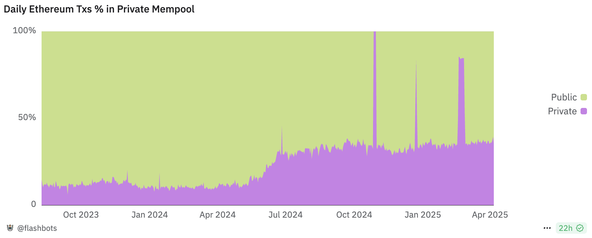

<!-- footer: '_Quelle: [Flashbots](https://dune.com/flashbots/mempool-hygrometer)_' -->

---

# >50% ETH Blockspace ist Privat

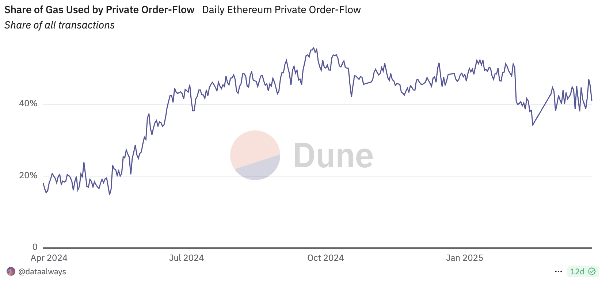

<!-- footer: '_Quelle: [Flashbots](https://dune.com/flashbots/mempool-hygrometer)_' -->

---

# Maximal Extractable Value (MEV)

<!-- This is the slide with custom styling -->

 
 

### A story of greedy miners👷, smart hackers🦹🏼, cunning algorithmic traders🤖 and ... an active field of research in a $650M+ industry💰

<!-- footer: '' -->

---

# Blockchain Recap

Eine wachsende Sequenz an Transaktionen, die in Blöcken angeordnet werden und mittels kryptographischer Methoden verkettet sind.

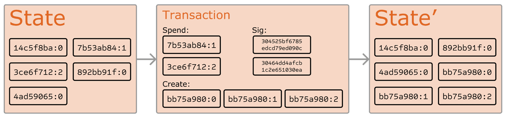

<!-- footer: '_Quelle: [Buterin]()_' -->

---

# Öffentliche Blockchain Recap

__Jeder__ kann Transaktionen einsehen und senden sowie am Konsensus Prozess teilnehmen (aka Transaktionen validieren).

 

<!-- footer: '_Quelle: [Buterin]()_' -->

---

# DeFi Recap

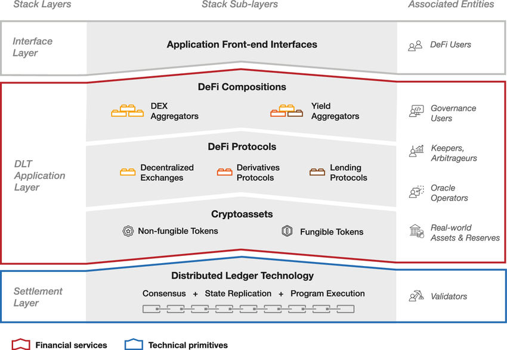

<!-- footer: '_Quelle: [Digital Finance Journal](https://link.springer.com/article/10.1007/s42521-023-00088-8)_' -->

---

# DeFi Markt

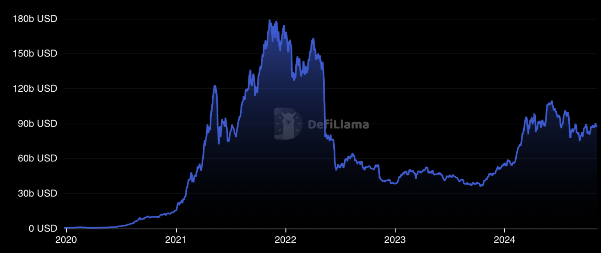

<!-- footer: '_Quelle: [Defillama](https://defillama.com)_' -->

---

# TX Lifecycle

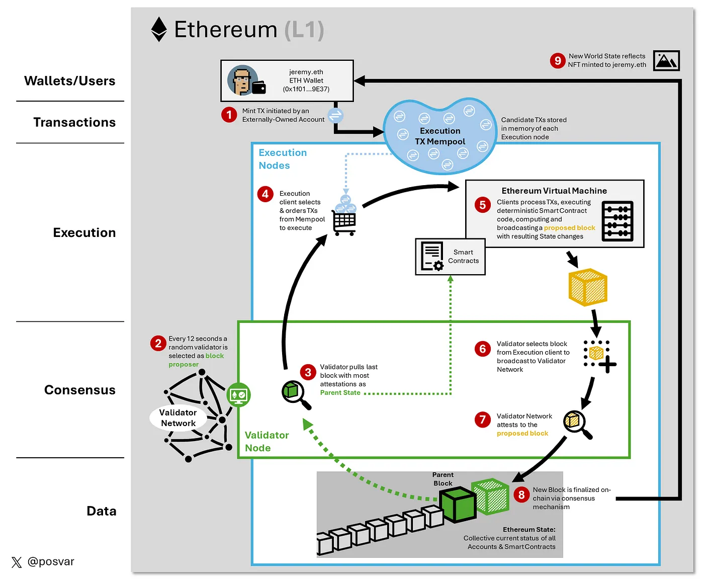

💡End-Nutzer bezahlen Miner/Validatoren für das Inkludieren von Transaktionen

💡Priorität ergibt sich aus dem gebotenen "Gaspreis"

<!-- footer: '_Quelle: [Jeremy Posvar](https://medium.com/@Posvar/visualizing-the-ethereum-machine-b39875830ded)_' -->

---

# Traditionelle vs. Kryptomärkte

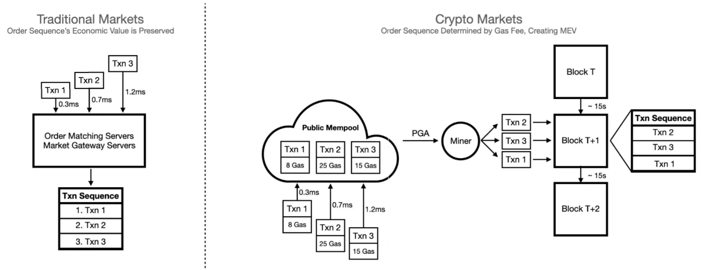

💡Keine zentrale (und regulierte) Gegenpartei, welche die Anordnung von Transaktionen bestimmt.

<!-- footer: '_Quelle: [Zhang and ](https://medium.com/@liamzhang/mev-a-deep-dive-part-1-3f389ef16d32)_' -->

---

# Public Mempools in Action

<!-- This is the slide with custom styling -->

 
 

## [txcity.io](https://txcity.io/v/eth-btc)

## [Mempool.space](https://mempool.space)

<!-- footer: '' -->

---

## Optimale Anordnung von Transaktionen

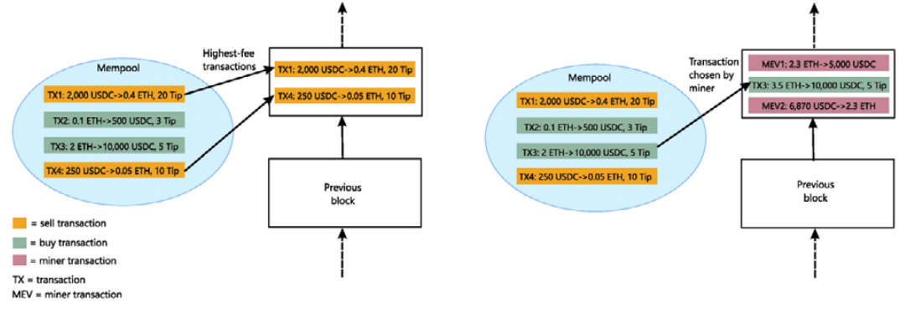

🚨 Kontrolle über die Anordnung von Transaktionen ermöglicht zusätzliche Arbitragegewinne ➡️ __Maximal Extractable Value__ (MEV)

<!-- footer: '_Quelle: [BIS Bulleting #58](https://www.bis.org/publ/bisbull58.pdf)_' -->

---

<!-- footer: '' -->

---

# Beispiel: Sandwich Attack

_Price Impact_ eines Trades auf Uniswap ist vorhersagbar!

<!-- footer: '_Quelle: [Uniswap](https://docs.uniswap.app)_' -->

---

# Beispiel (cont.)

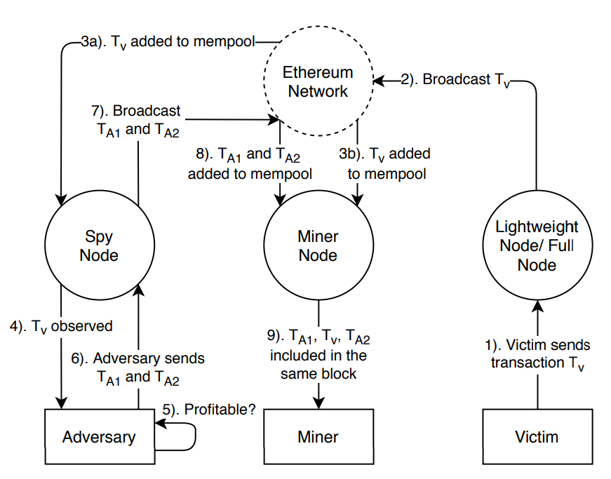

<!-- footer: '_Quelle: [Zhou et al](https://ieeexplore.ieee.org/document/9519421)_' -->

---

# Beispiel (cont.)

- Trader swaps $220K USDC
- MEV bot sandwiches swap:
  1. Swap out $19M USDC 
  2. Trader swap, $215K loss
  3. Swap in USDC, $208K profit
- $200K block builder "tip"
➡️ [TX on Etherscan](https://etherscan.io/tx/0xee9fcd2b9996e96b642cb4cda47fc140f98fdaf07ee02657743d4bfcc4670106)

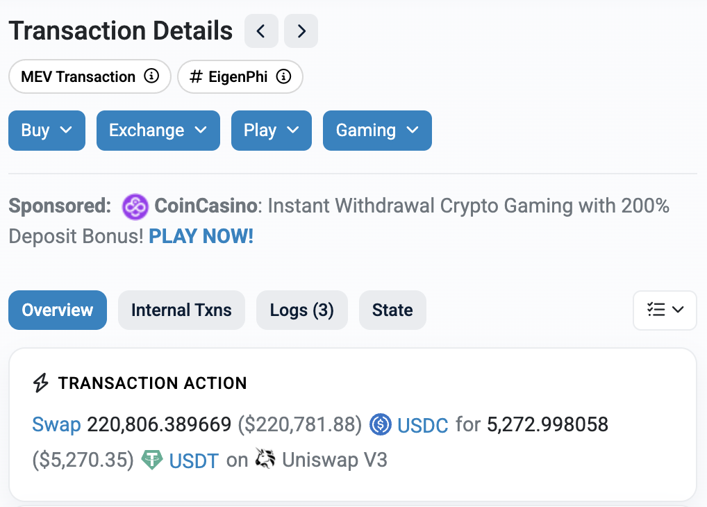

<!-- footer: '' -->

---

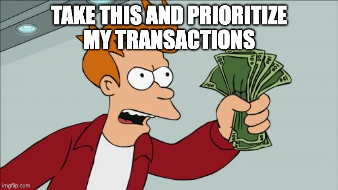

<!-- footer: '' -->

---

# Seminal Paper

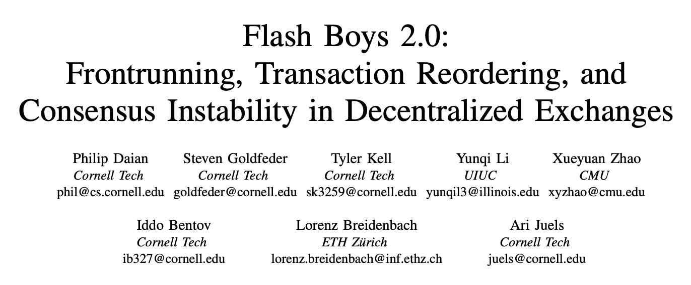

<!-- footer: '_Quelle: [Daian et al (Famous Flash Boys 2.0 paper)](https://arxiv.org/pdf/1904.05234)_' -->

---

# Priority Gas Auctions (PGAs)

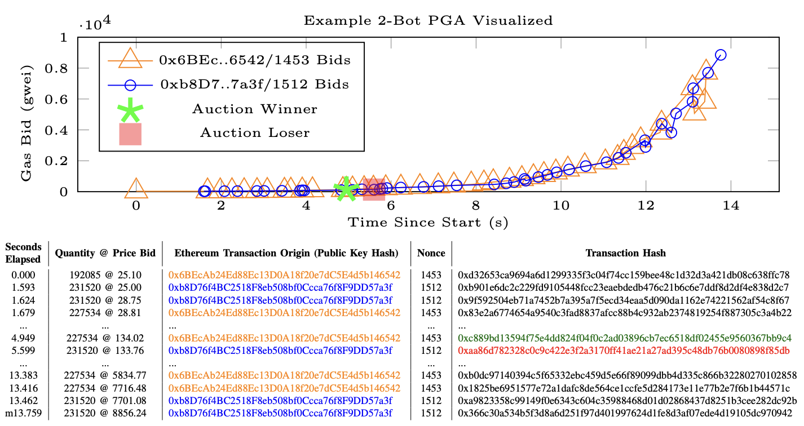

<!-- footer: '_Quelle: [Daian et al (Famous Flash Boys 2.0 paper)](https://arxiv.org/pdf/1904.05234)_' -->

---

# MEV Strategien

- DEX Arbitrage
- Liquidationen
- Front/Backrunning
- Sandwich Attacks
- Time-Bandit Attacks
- Uncle-Bandit Attacks

➡️ Weitere Infos [hier](https://etherworld.co/2022/04/05/mev-research-report/)

<!-- footer: '' -->

---

# MEV-Gewinne bis Ethereum "Merge"

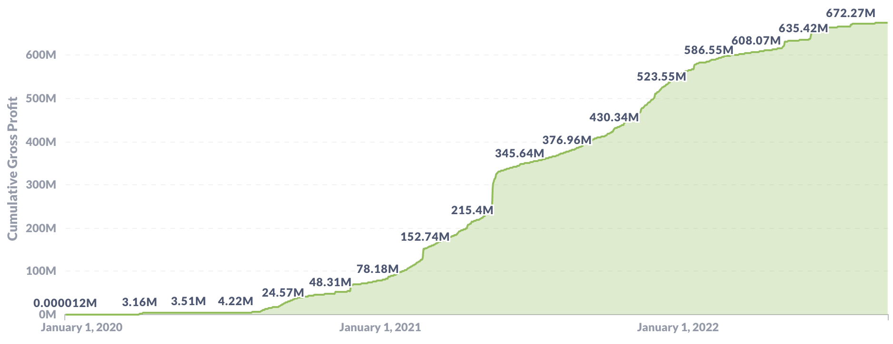

<!-- footer: '_Quelle: [mevboost.pics](https://mevboost.pics)_' -->

---

# Probleme von MEV

| Wer                    | Impact                                |
|----------------------- |-------------------------------------- |
| DeFi                   | Effizientere und sicherere Märkte     |
| Users                  | Schlechtere UX, höhere Transaktionskosten, längere Confirmation Times, Risiko von Verlusten, etc.                   |
| Netzwerk               | Höhere Gas Fees, Congestion           |
| Miners/ Validators     | Höhere Fee-Einnahmen, Zentralisierung |

---

# Lösungen für MEV

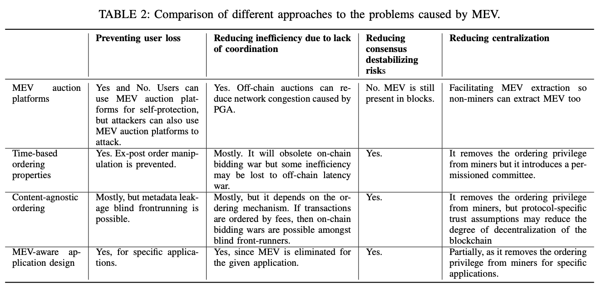

<!-- footer: '_Quelle: [Yang et al](https://dl.acm.org/doi/pdf/10.1145/3689931.3694911)_' -->

---

<!-- _class: lead -->

# <!--fit--> Lösung 1: Private TX Auktionen

---

# Ziele

- Keine Priority Gas Auktionen mehr
- Tiefere Gas Fees für user
- Kein Netzwerk Congestion
- Reduziere Zentralisierung

---

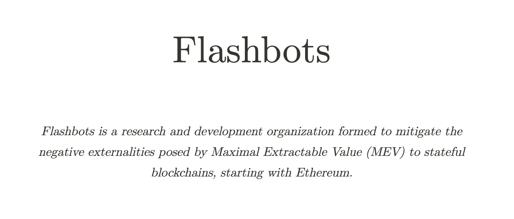

<!-- footer: '_Quelle: [Flashbots](https://www.flashbots.net/)_' -->

---

# Moderne MEV Supply Chain

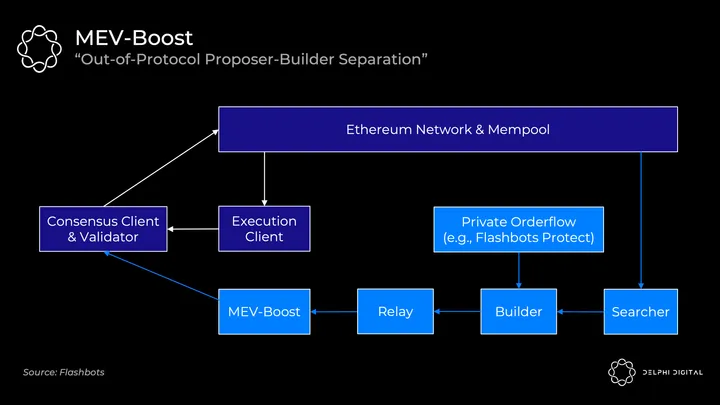

<!-- footer: '_Quelle: [DelphiDigital](https://members.delphidigital.io/reports/the-hitchhikers-guide-to-ethereum)_' -->

---

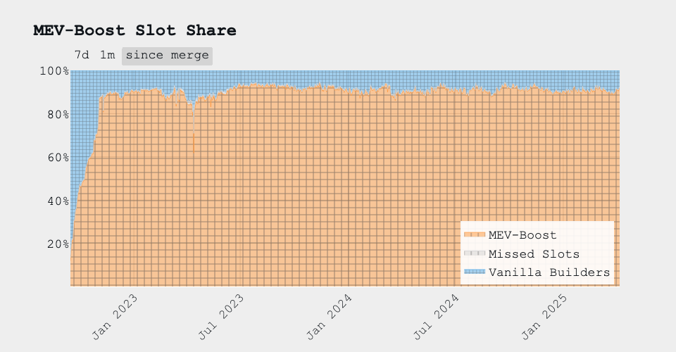

<!-- footer: '_Quelle: [mevboost.pics](https://mevboost.pics)_' -->

---

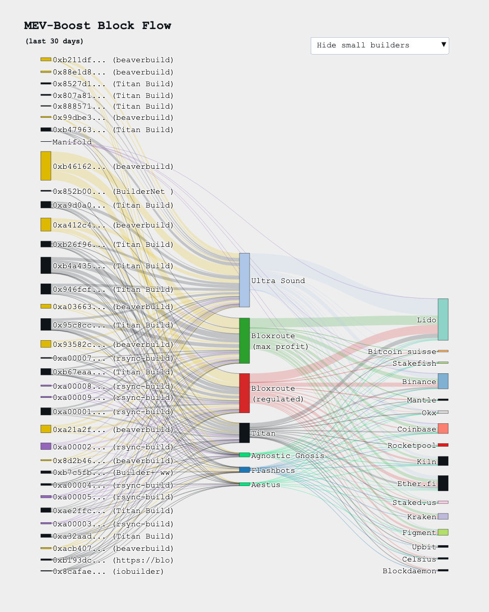

<!-- footer: '_Quelle: [mevboost.pics](https://mevboost.pics)_' -->

---

# Zentralisierung von Validatoren

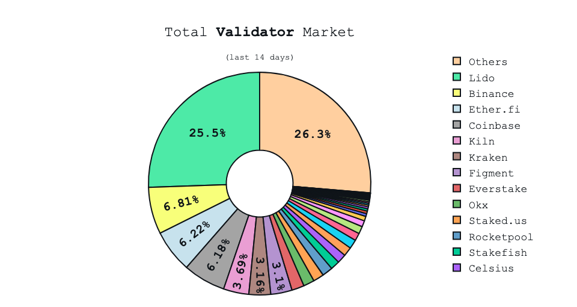

<!-- footer: '_Quelle: [mevboost.pics](https://mevboost.pics)_' -->
---

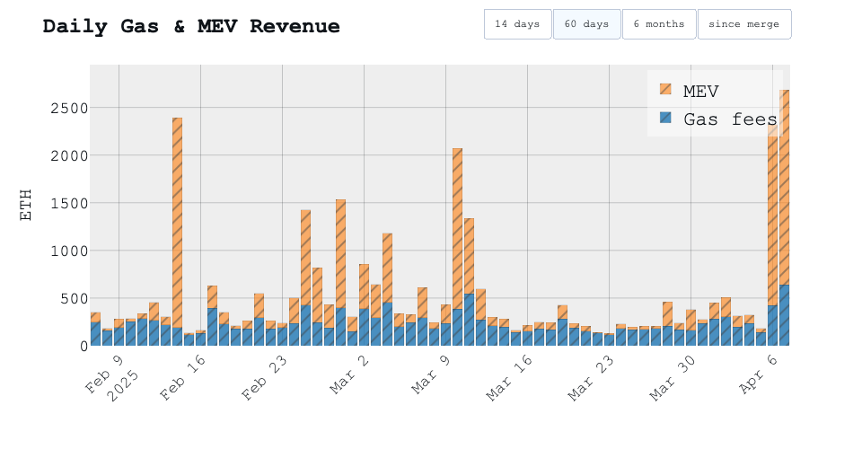

<!-- footer: '_Quelle: [mevboost.pics](https://mevboost.pics)_' -->

---

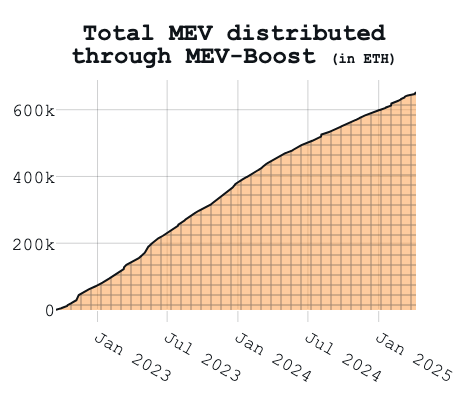

<!-- footer: '_Quelle: [mevboost.pics](https://mevboost.pics)_' -->

---

<!-- _class: lead -->

# <!--fit--> Lösung 2: Änderung Protokoll

---

# Todo

---

<!-- _class: lead -->

# <!--fit--> Lösung 3: Mitigation in DeFi

<!-- footer: '' -->

---

# Todo

---

<!-- _class: lead -->

# <!--fit--> Praktischer Teil

---

# TODO

---

<!-- This is the slide with custom styling -->

 
 
 

# Thank You!

 [@nilsbundi](https://twitter.com/nilsbundi)  
 [Nils Bundi](https://ch.linkedin.com/in/nils-bundi-6246b998)  
 [@nbundi](https://github.com/nbundi) 

<!-- footer: '' -->