<!-- _class: lead -->

# <!--fit--> Maximal Extractable Value

## CAS Blockchain und DeFi - FS2025

### Zurich University of Applied Sciences
### Dr. Nils Bundi

<!-- This is presenter note. You can write down notes through HTML comment. -->

---

<!-- _class: lead -->

**Dr. Nils Bundi**

DeFi F&E seit 2017 
Dozent [ZHAW SoE](https://zhaw.ch)
Präsident [DeFi Collective](https://deficollective.org)
DeFi Advisor/Gründer

--- 

# Programm

1. [MEV Einführung](#mev-einführung)
2. [MEV Auktionen](#mev-auktionen)
3. [Mitigation in DeFi Apps](#mitigation-in-defi-apps)
5. [Praktischer Teil](#praktischer-teil)

---

<!-- _class: lead -->

# <!--fit--> MEV Einführung

---

# >35% ETH TXs sind Privat

<!-- footer: '_Quelle: [Flashbots](https://dune.com/flashbots/mempool-hygrometer)_' -->

---

# >50% ETH Blockspace ist Privat

<!-- footer: '_Quelle: [Flashbots](https://dune.com/flashbots/mempool-hygrometer)_' -->

---

# Maximal Extractable Value (MEV)

<!-- This is the slide with custom styling -->

 
 

### A story of greedy miners👷, smart hackers🦹🏼, cunning algorithmic traders🤖 and ... an active field of research in a $1200M+ industry💰

<!-- footer: '' -->

---

# Blockchain Recap

Eine wachsende Sequenz an Transaktionen, die in Blöcken angeordnet werden und mittels kryptographischer Methoden verkettet sind.

<!-- footer: '_Quelle: [Buterin]()_' -->

---

# Öffentliche Blockchain Recap

__Jeder__ kann Transaktionen einsehen und senden sowie am Konsensus Prozess teilnehmen (aka Transaktionen validieren).

 

<!-- footer: '_Quelle: [Buterin]()_' -->

---

# DeFi Recap

<!-- footer: '_Quelle: [Digital Finance Journal](https://link.springer.com/article/10.1007/s42521-023-00088-8)_' -->

---

# DeFi Markt

<!-- footer: '_Quelle: [Defillama](https://defillama.com)_' -->

---

# TX Lifecycle

💡End-Nutzer bezahlen Miner/Validatoren für das Inkludieren von Transaktionen

💡Priorität ergibt sich aus dem gebotenen "Gaspreis"

<!-- footer: '_Quelle: [Jeremy Posvar](https://medium.com/@Posvar/visualizing-the-ethereum-machine-b39875830ded)_' -->

---

# Traditionelle vs. Kryptomärkte

💡Keine zentrale (und regulierte) Gegenpartei, welche die Anordnung von Transaktionen bestimmt.

<!-- footer: '_Quelle: [Zhang and ](https://medium.com/@liamzhang/mev-a-deep-dive-part-1-3f389ef16d32)_' -->

---

# Public Mempools in Action

<!-- This is the slide with custom styling -->

 
 

## [etherscan.io](https://etherscan.io/txsPending)

## [txcity.io](https://txcity.io/v/eth-btc)

## [Mempool.space](https://mempool.space)

<!-- footer: '' -->

---

## Optimale Anordnung von Transaktionen

🚨 Kontrolle über die Anordnung von Transaktionen ermöglicht zusätzliche Arbitragegewinne ➡️ __Maximal Extractable Value__ (MEV)

<!-- footer: '_Quelle: [BIS Bulleting #58](https://www.bis.org/publ/bisbull58.pdf)_' -->

---

<!-- footer: '' -->

---

# Beispiel: Sandwich Attack

_Price Impact_ eines Trades auf Uniswap ist vorhersagbar!

<!-- footer: '_Quelle: [Uniswap](https://docs.uniswap.app)_' -->

---

# Beispiel (cont.)

<!-- footer: '_Quelle: [Zhou et al](https://ieeexplore.ieee.org/document/9519421)_' -->

---

# Beispiel (cont.)

- Trader swaps $220K USDC
- MEV bot sandwiches swap:
  1. Swap out $19M USDC 
  2. Trader swap, $215K loss
  3. Swap in USDC, $208K profit
- $200K block builder "tip"
➡️ [TX on Etherscan](https://etherscan.io/tx/0xee9fcd2b9996e96b642cb4cda47fc140f98fdaf07ee02657743d4bfcc4670106)

<!-- footer: '' -->

---

<!-- footer: '' -->

---

# Seminal Paper

<!-- footer: '_Quelle: [Daian et al (Famous Flash Boys 2.0 paper)](https://arxiv.org/pdf/1904.05234)_' -->

---

# Priority Gas Auctions (PGAs)

<!-- footer: '_Quelle: [Daian et al (Famous Flash Boys 2.0 paper)](https://arxiv.org/pdf/1904.05234)_' -->

---

# MEV Strategien

- DEX Arbitrage
- Liquidationen
- Front/Backrunning
- Sandwich Attacks
- Time-Bandit Attacks
- Uncle-Bandit Attacks

➡️ Weitere Infos [hier](https://etherworld.co/2022/04/05/mev-research-report/)

<!-- footer: '' -->

---

# MEV-Gewinne bis Ethereum "Merge"

<!-- footer: '_Quelle: [mevboost.pics](https://mevboost.pics)_' -->

---

# Probleme von MEV

| Wer                    | Impact                                |
|----------------------- |-------------------------------------- |
| DeFi                   | Effizientere und sicherere Märkte     |
| Users                  | Schlechtere UX, höhere Transaktionskosten, längere Confirmation Times, Risiko von Verlusten, etc.                   |
| Netzwerk               | Höhere Gas Fees, Congestion           |
| Miners/ Validators     | Höhere Fee-Einnahmen, Zentralisierung |

---

# Lösungen für MEV

<!-- footer: '_Quelle: [Yang et al](https://dl.acm.org/doi/pdf/10.1145/3689931.3694911)_' -->

---

<!-- _class: lead -->

# <!--fit--> MEV Auktionen

<!-- footer: '' -->

---

# Ziele

- Keine Priority Gas Auktionen (PGA) mehr
- Tiefere Gas Fees für Nutzer
- Reduktion Netzwerk Congestion
- Fix Zentralisierung

---

# Idee

- Reguläre Transaktionen mittels Public Mempool
- Offload MEV "Bundles" an spezialisierte Miner/Validators
- MEV "bidding wars" finden im privaten Netzwerk statt
- Reguläre Transaktionen sind nicht mehr (direkt) betroffen

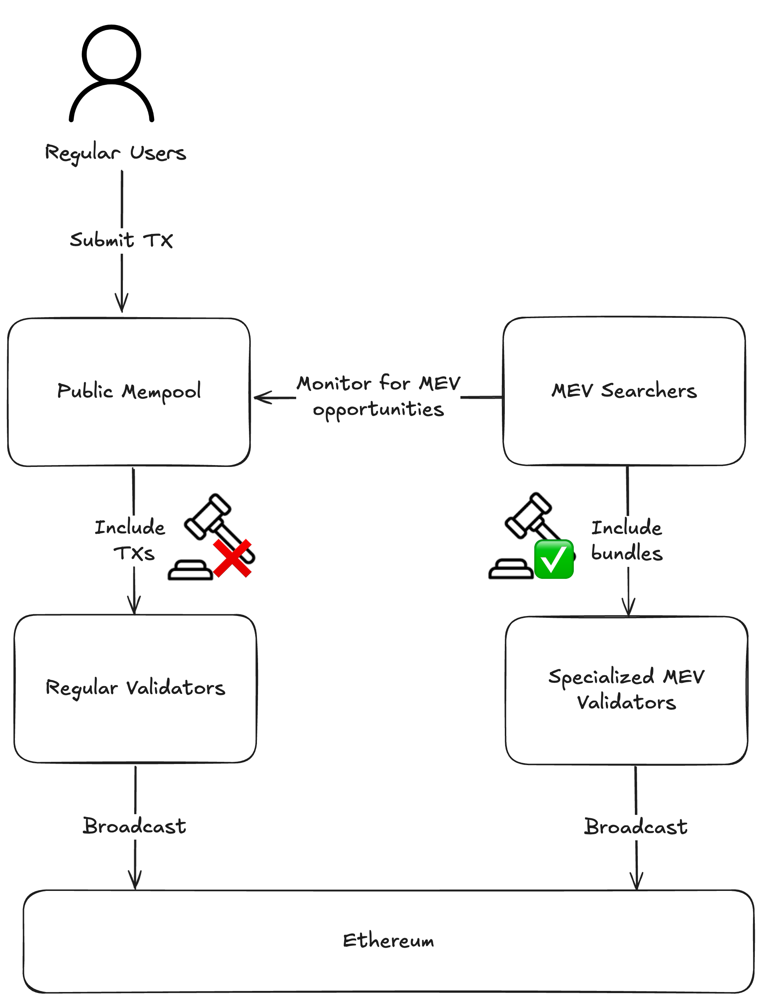

---

<!-- footer: '_Quelle: [Flashbots](https://www.flashbots.net/)_' -->

---

# Flashbots History

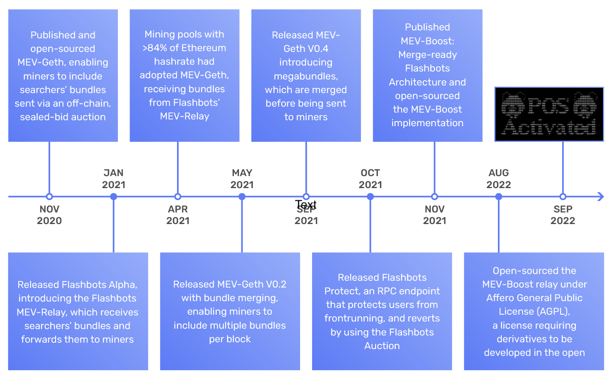

<!-- footer: '_Quelle: [Treehouse Labs](https://trhx.com/research/ethereums-hidden-tax-maximal-extractable-value-mev)_' -->

---

# Moderne MEV Supply Chain

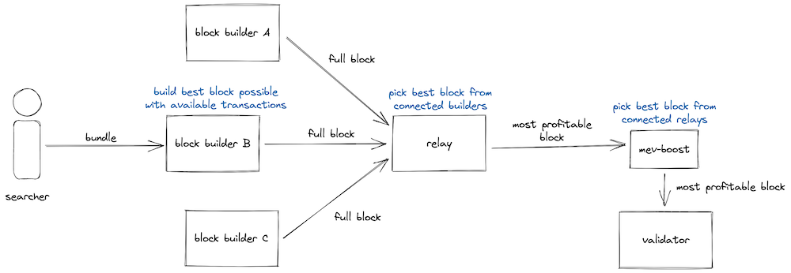

<!-- footer: '_Quelle: [DelphiDigital](https://members.delphidigital.io/reports/the-hitchhikers-guide-to-ethereum)_' -->

---

<!-- footer: '_Quelle: [mevboost.pics](https://mevboost.pics)_' -->

---

<!-- footer: '_Quelle: [mevboost.pics](https://mevboost.pics)_' -->

---

<!-- footer: '_Quelle: [mevboost.pics](https://mevboost.pics)_' -->

---

<!-- footer: '_Quelle: [mevboost.pics](https://mevboost.pics)_' -->

---

# Problem gelöst?

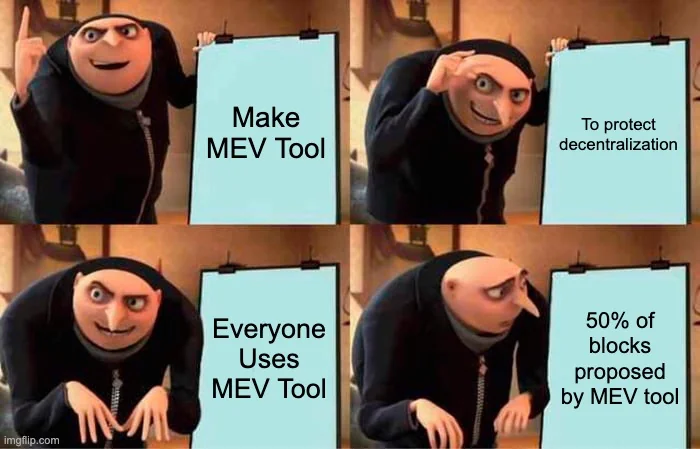

<!-- footer: '' -->

---

# Zentralisierung von Validatoren

<!-- footer: '_Quelle: [mevboost.pics](https://mevboost.pics)_' -->

---

<!-- _class: lead -->

# <!--fit--> Mitigation in DeFi Apps

<!-- footer: '' -->

---

<!-- This is the slide with custom styling -->

 
 
 
 

# DeFi Nutzer sind betroffen!

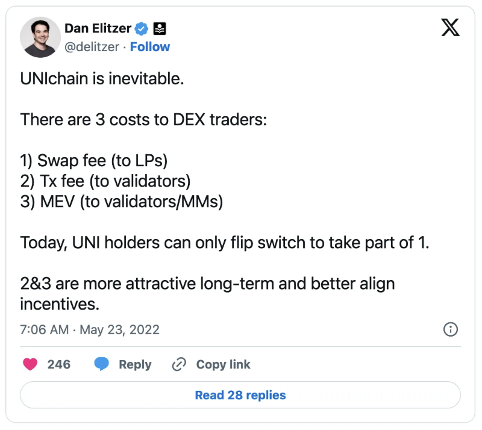

---

# Uniswap Trade Kosten

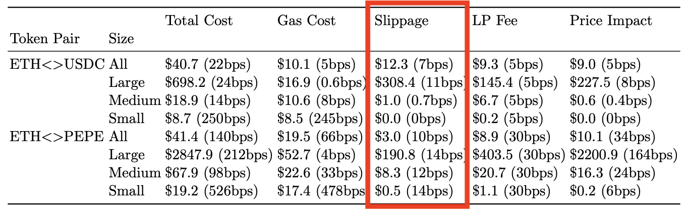

Empirische Kosten für Trades auf Uniswap nach Paar und Trade Size (Large: >$100,000; Medium: >$1,000; Small <$1,000).

<!-- footer: '_Quelle: [Adams et al](https://link.springer.com/chapter/10.1007/978-3-031-78676-1_10s)_' -->

---

# MEV Volumen nach DeFi App

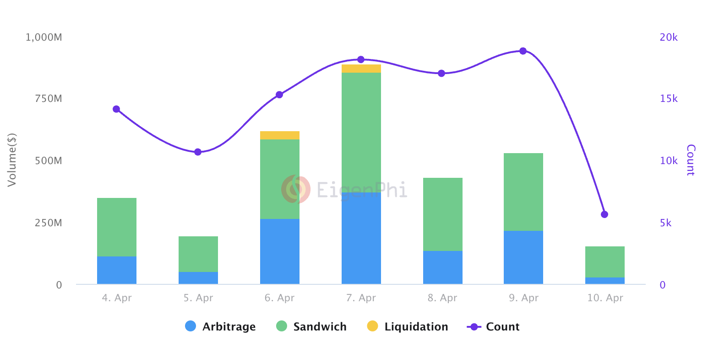

<!-- footer: '_Quelle: [Eigenphi](https://eigenphi.io/)_' -->

---

<!-- This is the slide with custom styling -->

 
 
 
 

## [MEV Livestream (Eigenphi)](https://eigenphi.io/mev/ethereum/txr)

<!-- footer: '' -->

---

<!-- This is the slide with custom styling -->

 
 
 

# Wie Schützen wir Nutzer?

---

# Strategien zum Schutz vor MEV

| Strategie                | Beschreibung        | Beispiele |
|------------------------- |-------------------- |--------- |
| Slippage Toleranz        | Nutzer definiert maximal in Kauf genommener Verlust für Trade | Uniswap, DEXs |
| MEV-less RPCs           | Privater "Mempool" welcher MEV blockiert. Ähnlich zu privaten MEV Auktionen | MEV Blocker |
| Natives Protokoll-Design | Die Möglichkeit für MEV wird direkt im DeFi Protokoll berücksichtigt  | COWSwap |

---

# Beispiel Ekubo DEX

- Nutzer definiert _Max slippage_ bzw. den maximal akzeptierten Trade Preis
- Uniswap führt den Trade bloss unter Einhaltung dieser Kondition durch
- MEV Verlust limitiert

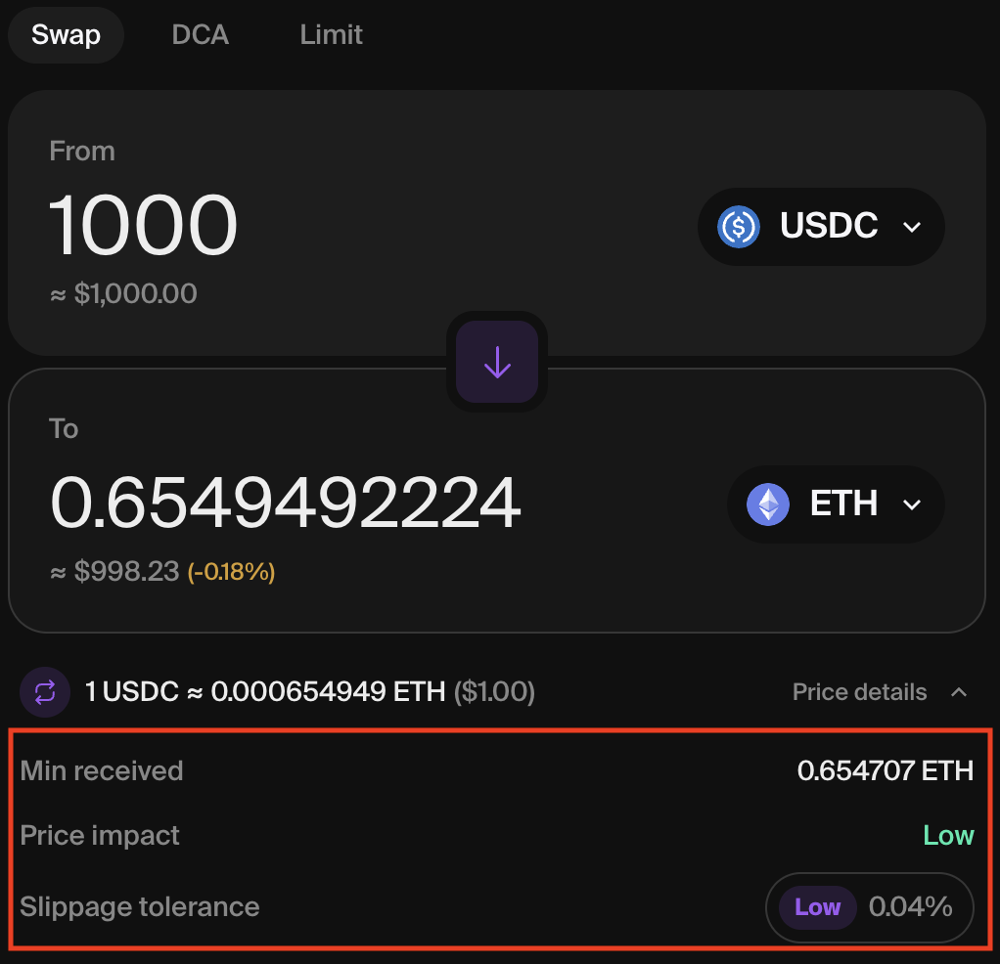

<!-- footer: '_Quelle: [Uniswap](https://app.uniswap.org)_' -->

---

# Beispiel Uniswap

 
 

Analog zu Ekubo DEX

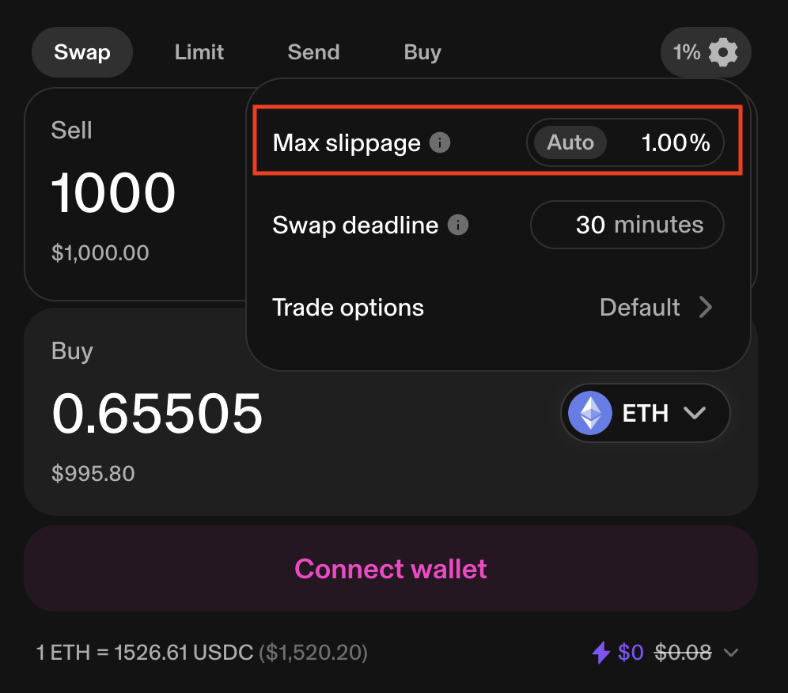

<!-- footer: '_Quelle: [Uniswap](https://app.uniswap.org)_' -->

---

# Beispiel MEV Blocker

- Einstellen direkt in Wallet
- _MEV Blocker_ als neuen RPC Endpoint hinzufügen
- Wallet sendet TXs dann an diesen Endpoint
- TXs landen nicht mehr im Public Mempool

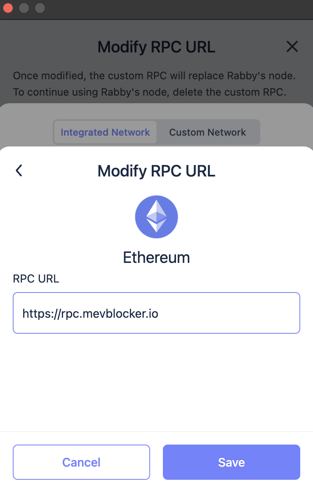

<!-- footer: '_Quelle: [COWSwap](https://cow.fi/learn/understanding-mev-protection)_' -->

---

# Beispiel MEV Blocker (cont.)

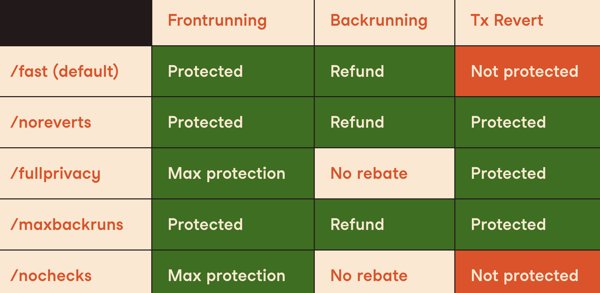

<!-- footer: '_Quelle: [COWSwap](https://cow.fi/learn/understanding-mev-protection)_' -->

---

# Beispiel COWSwap

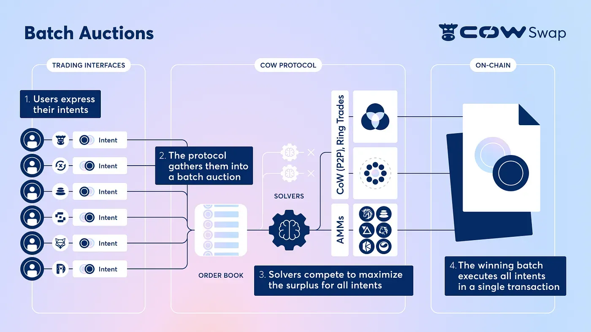

<!-- footer: '_Quelle: [COWSwap](https://cow.fi/learn/understanding-mev-protection)_' -->

---

<!-- _class: lead -->

# <!--fit--> Praktischer Teil

---

<!-- This is the slide with custom styling -->

 
 
 

# Thank You!

 [@nilsbundi](https://twitter.com/nilsbundi)  
 [Nils Bundi](https://ch.linkedin.com/in/nils-bundi-6246b998)  
 [@nbundi](https://github.com/nbundi) 

<!-- footer: '' -->