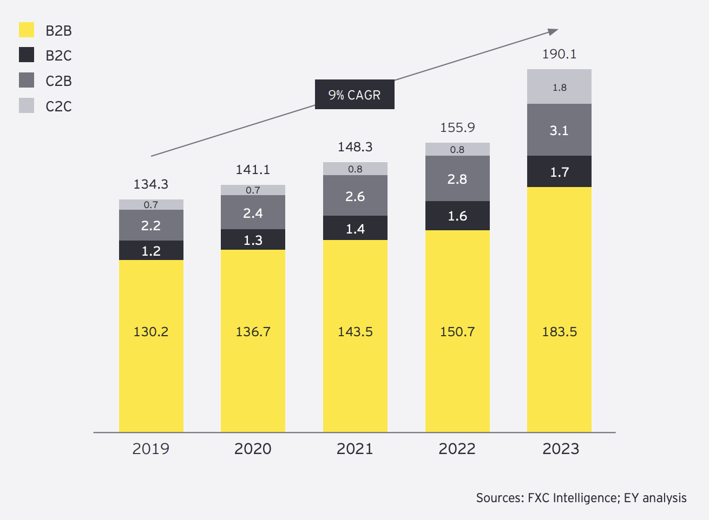
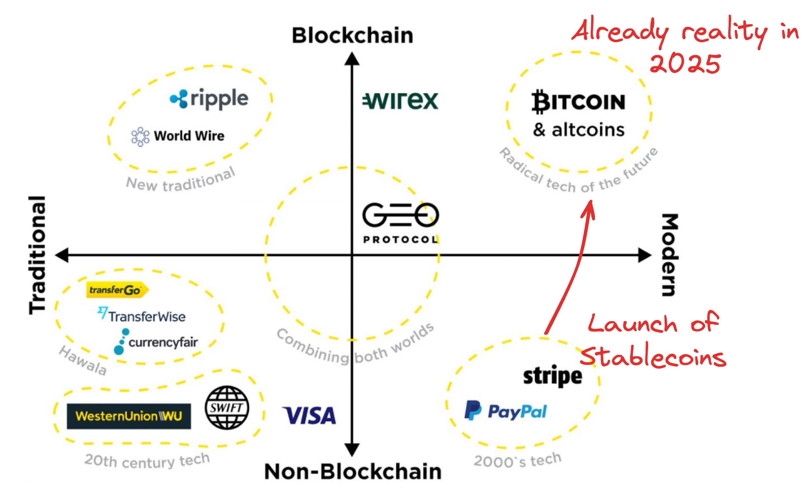

<!-- _class: lead -->

# <!--fit--> DeFi Payments

## CAS Blockchain und DeFi - FS2025

### Zurich University of Applied Sciences
### Dr. Nils Bundi

<!-- This is presenter note. You can write down notes through HTML comment. -->

---

<!-- _class: lead -->

**Dr. Nils Bundi**

DeFi F&E seit 2017 
Dozent [ZHAW SoE](https://zhaw.ch)
Präsident [DeFi Collective](https://deficollective.org)
DeFi Advisor/Gründer

--- 

# Wachsender Markt

<!-- footer: '_Quelle: [EY](https://www.ey.com/content/dam/ey-unified-site/ey-com/en-gl/industries/wealth-asset-management/documents/ey-gl-banking-beyond-borders-10-2024.pdf)_' -->

---

# Typisches Cross-border Payment

<!-- footer: '_Quelle: [SSRN](https://papers.ssrn.com/sol3/papers.cfm?abstract_id=4328948)_' -->

---

# Technologien (2019)

<!-- footer: '_Quelle: Basierend auf [Fintech Times](https://thefintechtimes.com/cross-border-payments/)_' -->

---

# G20 Ziele

<!-- footer: '_Quelle: [EY](https://www.ey.com/content/dam/ey-unified-site/ey-com/en-gl/industries/wealth-asset-management/documents/ey-gl-banking-beyond-borders-10-2024.pdf)_' -->

---

# Alternative Technologien

<!-- footer: '_Quelle: [EY](https://www.ey.com/content/dam/ey-unified-site/ey-com/en-gl/industries/wealth-asset-management/documents/ey-gl-banking-beyond-borders-10-2024.pdf)_' -->

---

# CBP mittels Bitcoin/Lightning

 

<!-- footer: '_Quelle: [River Research 06/2023](https://river.com/learn/files/river-payments-report.pdf)_' -->

---

# Lightning Netzwerk

- Txs auf Bitcoin sind teuer
- "Offchain" P2P Zahlungskanäle
- Günstige Bitcoin Txs
- Verwendet für Alltägliches & Remittances

<!-- footer: '_Quelle: [Journal of Theoretical and Applied Ecommerce Research](https://www.mdpi.com/0718-1876/18/3/68)_' -->

---

# BTC Terminals Weltweit

<!-- footer: '_Quelle: [BTCMap](https://btcmap.org/)_' -->

---

# BTC Terminals Trend

<!-- footer: '_Quelle: [BTCMap](https://btcmap.org/)_' -->

---

<!-- footer: '_Quelle: [River Research 10/2023](https://river.com/learn/files/river-lightning-report-2023.pdf)_' -->

---

<!-- footer: '_Quelle: [River Research 2025](https://river.com/learn/files/river-bitcoin-adoption-report-2025.pdf)_' -->

---

# Lightning Network Capacity

<!-- footer: '_Quelle: [bitcoinvisuals](https://bitcoinvisuals.com//)_' -->

---

# CBP mittels Stablecoins

<!-- footer: '_Quellen: [SSRN](https://papers.ssrn.com/sol3/papers.cfm?abstract_id=4328948)_' -->

---

# Top 8 Stablecoin Issuers

<!-- footer: '_Quellen: [CoinGecko](https://www.coingecko.com/research/publications/state-of-stablecoins-2024)_' -->

---

# Stablecoin Marktkapitalisierung

<!-- footer: '_Quelle: [CoinGecko](https://www.coingecko.com/research/publications/state-of-stablecoins-2024)_' -->

---

# PayPal PYUSD Payments

<!-- footer: '_Quelle: [PayPal]()_' -->

---

# CBP Kosten mittels DeFi

- Aufstellung per 2023
- Weitere Reduktion der Fixkosten (Netzwerk Tx Fees) um Faktor 10 (Ethereum) bis 100 (L2) per 2025
- 2025: **Min. 0.01%+$0.001**

<!-- footer: '_Quellen: [SSRN 2023](https://papers.ssrn.com/sol3/papers.cfm?abstract_id=4328948), [Growthepie](https://www.growthepie.xyz/)_' -->

---

# Kosten für $500 CBP im Vergleich

<!-- footer: '_Quelle: [SSRN 2023](https://papers.ssrn.com/sol3/papers.cfm?abstract_id=4328948)_' -->

---

# CBP Lösungen im Vergleich

<!-- footer: '_Quelle: [River Research 2023](https://river.com/learn/files/river-payments-report.pdf)_' -->

---

<!-- This is the slide with custom styling -->

 
 
 

# Thank You!

 [@nilsbundi](https://twitter.com/nilsbundi)  
 [Nils Bundi](https://ch.linkedin.com/in/nils-bundi-6246b998)  
 [@nbundi](https://github.com/nbundi) 

<!-- footer: '' -->