<!-- _class: lead -->


# <!--fit--> Kryptoassets und Wallets

## Weiterbildungskurs

### Dr. Nils Bundi


<!-- This is presenter note. You can write down notes through HTML comment. -->

---

# Kryptoassets auf dem Vormarsch


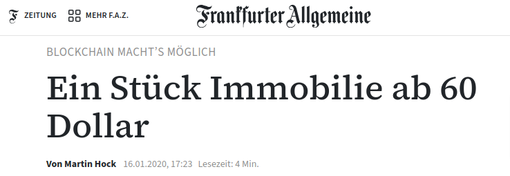

---

# Was sind Kryptoassets?

> [...] digitale Vermögenswerte, die meist auf einer Blockchain abgebildet werden. Sie unterscheiden sich von anderen Vermögenswerten, da nur mithilfe eines kryptobasierten Zugangsverfahrens über sie verfügt werden kann. In der Regel wird dafür ein Schlüsselpaar verwendet, bestehend aus einem
geheim zu haltenden privaten (Private Key) und einem öffentlichen Schlüssel (Public Key).

<!-- footer: '_Quelle: [FINMA](https://www.finma.ch/en/~/media/finma/dokumente/dokumentencenter/myfinma/faktenblaetter/faktenblatt-kryptobasierte-vermoegenswerte.pdf?sc_lang=de&hash=C301BDEC9A7DED4EF2E23634B86F8FEF)' -->

---

<style scoped>
/* Reset table styling provided by theme */
table, tr, td, th {
  all: unset;
  /* Override contextual styling */
  border: 0 !important;
  background: transparent !important;
}
table { display: table; }
tr { display: table-row; }
td, th { display: table-cell; }
/* ...and layout freely :) */
table {
  width: 90%;
  border-spacing: 40pt;
  font-size: 40pt;
}
th {
  color: black;
  text-align: center;
  vertical-align: middle;
}
td {
  text-align: center;
  vertical-align: middle;
}
</style>

# Kryptoassets Markt

<br>

| __9'972__ Tokens*     | __$2.5t__ MCAP       |
| --------------------- | ------------------- |
| __$70b__ Volume (24h) | __500m__ Token Holders |


_*Nur "aktive" Tokens nach CoinMarketCap_ 

<!-- footer: '_Quelle: [CoinMarketCap](https://coinmarketcap.com), [Token Terminal](https://tokenterminal.com/terminal/metrics/tokenholders)  (Mai 2024)_' -->


---

# Marktkapitalisierung

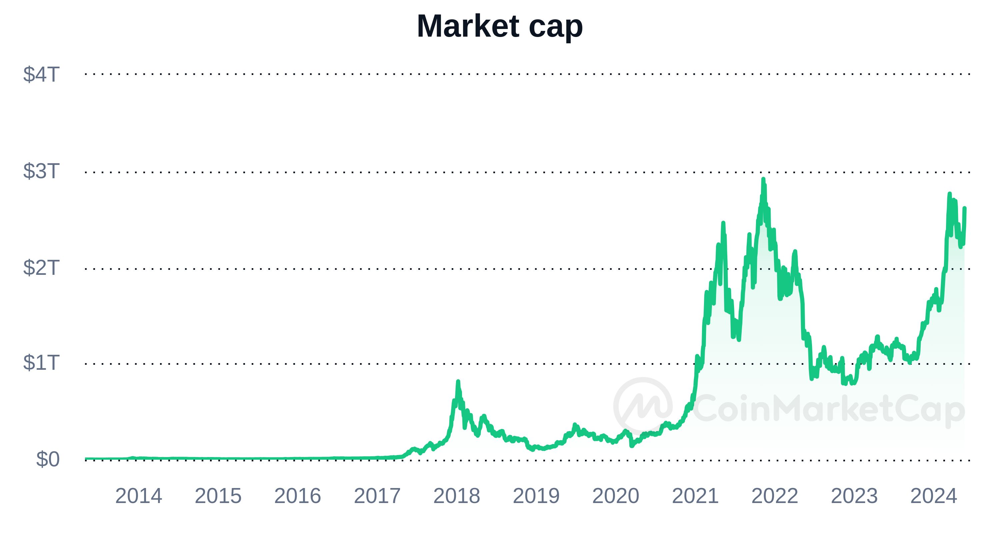

<!-- footer: '_Quelle: [CoinMarketCap](https://coinmarketcap.com)_' -->

---

# Marktstruktur (nach MCAP)

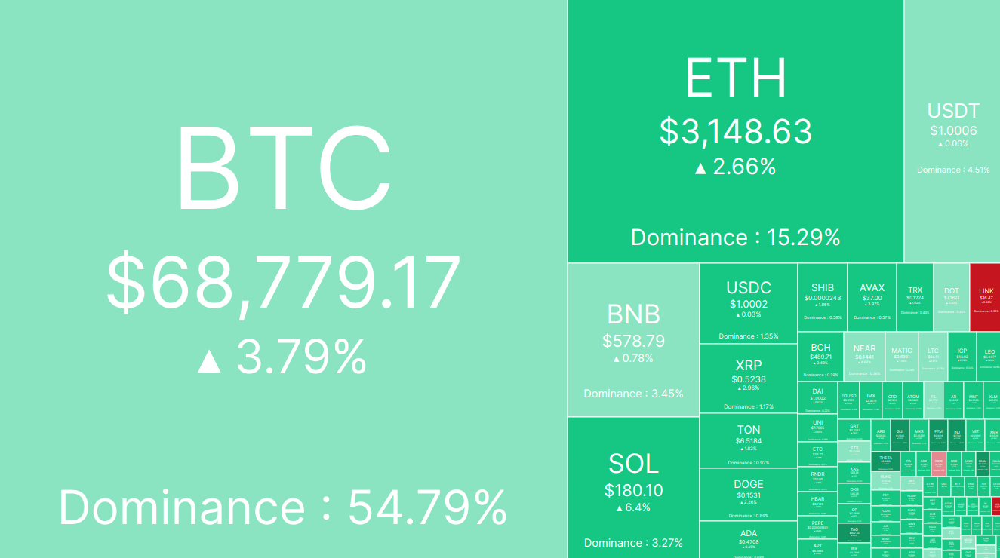

<!-- footer: '_Quelle: [CoinMarketCap](https://coinmarketcap.com/crypto-heatmap/) (Mai 2024)_' -->

---

# DeFi Stack

- Kryptoassets bilden die Basis für DeFi
- Innovation durch offene Schnittstellen
- Globaler Vertrieb mittels öffentlicher Blockchain
- Verschiedene Umsetzungen

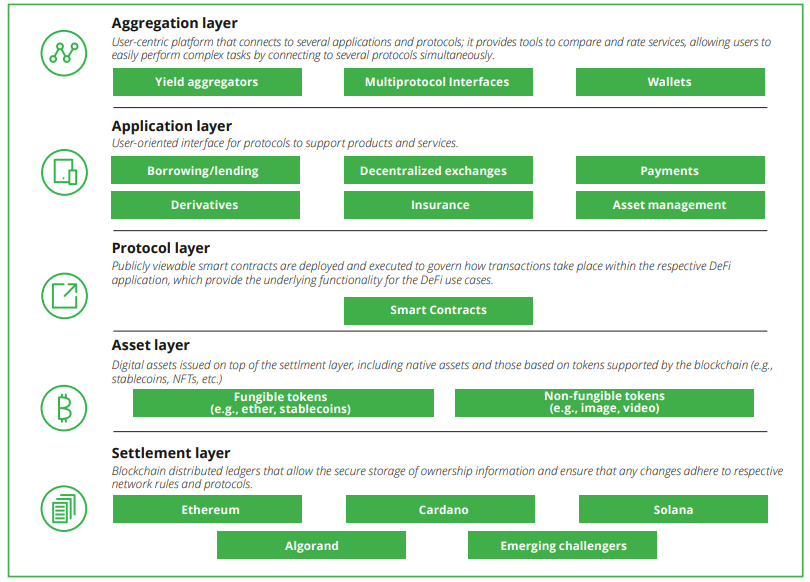

<!-- footer: '_Quelle: [Deloite](https://www2.deloitte.com/content/dam/Deloitte/us/Documents/risk/us-financial-advisory-defi-march-2022.pdf) nach [Schär](https://doi.org/10.20955/r.103.153-74)_' -->

---

# Technische Ausgestaltung

<br>

| | __Native Coin__     | __Fungible Token__     | __Non-Fungible Token__ |
| --- | --------------------- | ------------------- | -------------------|
| Implemen-tation | Blockchain Protokol | Smart Contract | Smart Contract | 
| Standards | -  | ERC-20 | ERC-721 |
| Beispiele | Bitcoin, Ether, Solana | USDC, Link, Shiba Inu | BAYC, Uniswap LPs, Axies

<!-- footer: "" -->

---

# Beispiel ERC-20 Token Standard

- Vorgestellt am 19.11.2015
- Definiert Schnittstellen für (fungible) Token Smart Contracts
- Implementation als Smart Contract auf einer Blockchain
- Standardisierung als Katalysator für Innovation: ermöglicht die offene, effiziente und sichere Entwicklung von DeFi Apps
- Definition: https://eips.ethereum.org/EIPS/eip-20

---

# ERC-20 Token (unvollständing)

```typescript
contract ERC20 {
    mapping(address account => uint256) private _balances;
    uint256 private _totalSupply;
    string private _name;
    string private _symbol;

    function balanceOf(address account) public view virtual returns (uint256) {
        return _balances[account];
    }
    function transfer(address to, uint256 value) public virtual returns (bool) {
        address owner = _msgSender();
        _balances[owner] -= value;
        _balances[to] += value;
        return true;
    }
```

---

# Global Crypto Taxonomy

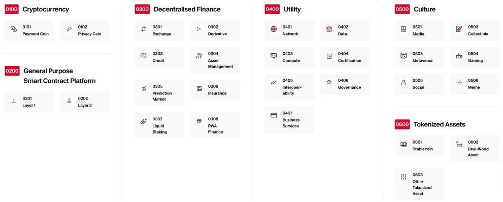

<!-- footer: '_Quelle: [Bitcoin Suisse](https://www.bitcoinsuisse.com/crypto-taxonomy)_' -->

---

# Cryptocurrency

- Kryptoassets mit Geld-ähnlichen Eingenschaften
- Kein weiterer Nutzen als "medium of exchange", "store of value", "unit of account"
- Kann "privacy preserving" Charakteristika aufweisen (bspw. Verschleierung von "owner accounts")
- Meist in Form von "native coins"
- Bspw. Bitcoin, Ripple, Litecoin, etc.

<!-- footer: "" -->

---

# Decentralized Finance

- Kryptoassets, die von einem DeFi Projekt ausgegeben werden
- Haben oft einen impliziten Nutzen e.g. als Stimmrecht (Governance Token) oder Staking (Fee Capture Token)
- Werden oft an Nutzer verteilt (Airdrops) mit dem Ziel
    - Nutzer-Acquirierung (Bootstrapping)
    - Dezentralisierung von Governance (DAOs)
- Meist in Form von "fungible tokens" oder ERC-20s
- Bspw. Uniswap, Link, Aave, Maker, Liquity, etc.

---

# Stablecoins

- Sollen dem Preis eines Referenzassets folgen, e.g.
    - Circle's EURC $\approx$ 1 EUR
    - Liquity's LUSD $\approx$ 1 USD
    - Synthetix' sETH $\approx$ 1 ETH
- Verschiedene "Peg"-Mechanismen
    - Centralized, 100% Fiat/Treasuries backed
    - Decentralized, 100% Kryptoasset backed
    - Algorithmisch oder "Fractional Reserve" (<100% Backing)

---

# Stablecoin Trilemma


<!-- footer: '_Quelle: [Viswanath-Natraj and Amit Chaudhary](https://cepr.org/voxeu/columns/algorithmic-stablecoins-and-devaluation-risk)_' -->

---

# Beispiel USDC

- USD Stablecoin ausgegeben von Circle 
- 100% backing durch Cash und "Equivalents"
- \$33b MCAP ($\approx$ 1.3%)
- Sehr stabil und liquide

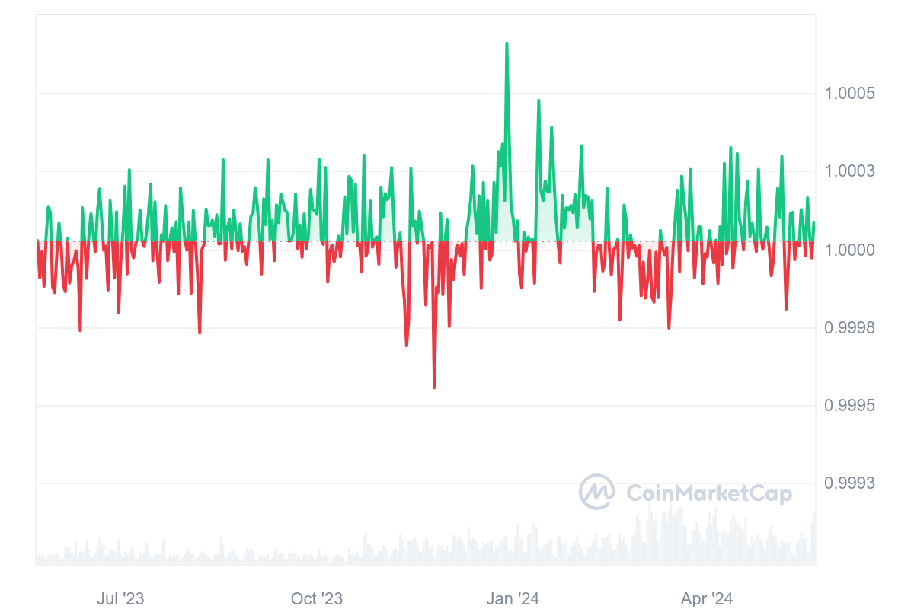

<!-- footer: '_Quelle: [CoinMarketCap](https://coinmarketcap.com/currencies/usd-coin/)_' -->

---

# Beispiel USDC Depeg

- Depeg im März 2023 
- Ausgelöst durch Kollaps von Silicon Valley Bank
- SVB verwahrt ca. $3.3b USD für Circle
- "Bank run" als Reaktion
- Stablecoin [Rating](https://bluechip.org)

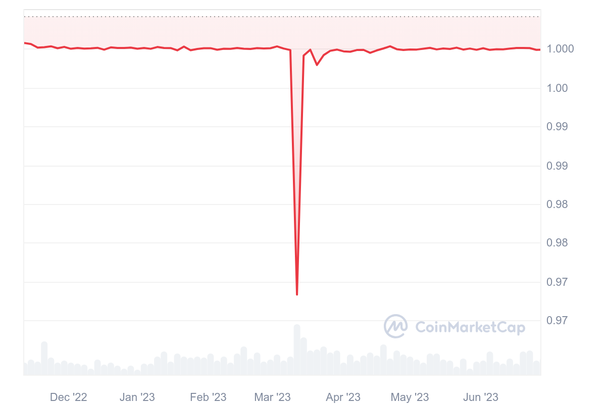

<!-- footer: '_Quelle: [CoinMarketCap](https://coinmarketcap.com/currencies/usd-coin/)_' -->

---

# Real-World Assets (RWAs)

- Tokenisierung von "regulären" Assets
- Besteht normalerweise aus
    - Rechtsstruktur: SPV o.ä. hält ("real-world") Assets
    - Primärmarkt: Emission von Token mit Anspruch auf Assets
    - Sekundärmarkt: Handel (bspw. mittels DEX) von Token
- Ermöglicht die Tokenisierung jegwelcher Assets
- Bspw. Paxos Gold, Private Debt, Tokenisierte "Treasuries"

<!-- footer: "" -->

---

# Tokenisierte "Treasuries"

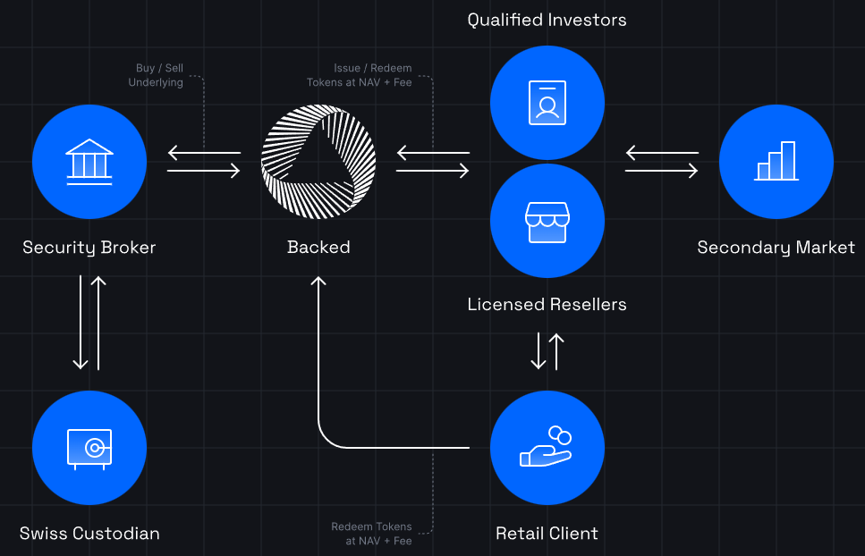

<!-- footer: '_Quelle: [Backed](https://assets.backed.fi/structure)_' -->

---

# Krypto Custody

- Blockchain Konten bestehen aus einem öffentlichen und privaten Schlüssen (Public / Private Key Pair)
- Kryptoassets werden mittels solcher Konten verwahrt
- Transaktionen werden mittels dem Private Key bestätigt
- Custody von Kryptoassets beschäftigt sich mit der (sicheren) Aufbewahrung des Private Key's
- __Achtung:__ Wiederherstellung des Private Key's, bspw. bei Verlust, ist nicht möglich!

<!-- footer: "" -->

---

# Custodial vs. Non-Custodial Wallets

|                    | Custodial | Non-Custodial |
| :----------------- | :-------- | :------------ |
| Verantwortlichkeit | Drittpartei verwahrt den PK | Nutzer verwahrt den PK |
| Sicherheit         | Abhängig vom Verwahrer | Abhängig vom Nutzer (und Wallet) |
| Wiederherstellung  | Durch Verwahrer | Abhängig vom Wallet |
| Kompatibilität | Meist nicht DeFi kompatibel | DeFi kompatibel |

---

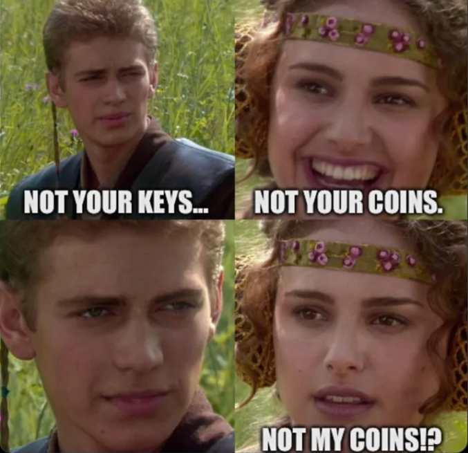

---

# FTX Exchange Kollaps

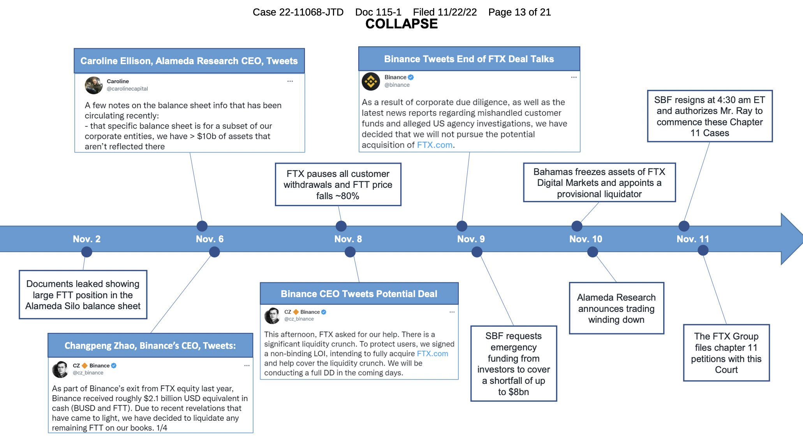

---

# Arten von Wallets

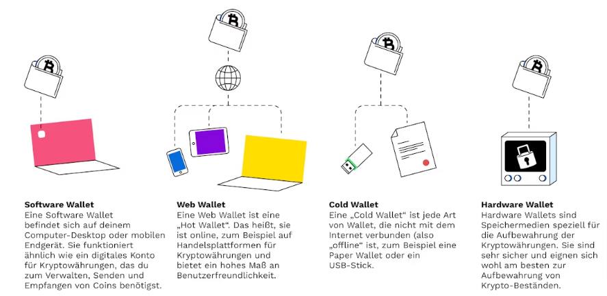

<!-- footer: '_Quelle: [Bitpanda](https://www.bitpanda.com/academy/de/lektionen/was-ist-eine-wallet-und-wo-bekomme-ich-eine/)' -->

---

# Beispiel [Argent](https://argent.xyz)

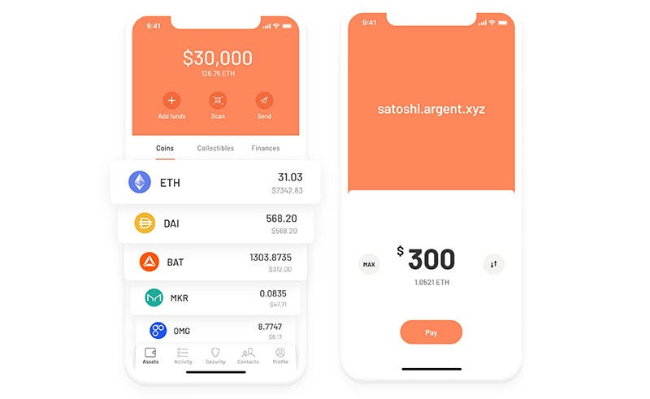

<!-- footer: "" -->