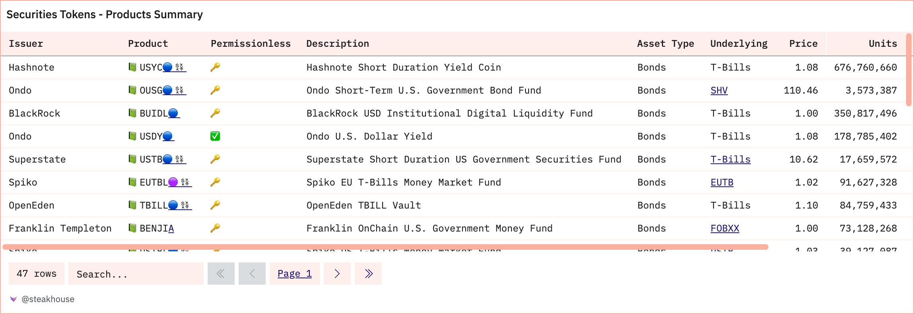

<!-- _class: lead -->


# <!--fit--> Cryptoassets, Stablecoins, Tokenization

## Continuing Education Course
### Dr. Nils Bundi


<!-- This is presenter note. You can write down notes through HTML comment. -->

---

<style scoped>{font-size: 36px}</style>


### Dr. Nils Bundi

<br>
<br>

 Founder [Vesu Lending](https://vesu.xyz)
 President [DeFi Collective](https://deficollective.org)
 Lecturer [ZHAW School of Engineering](https://zhaw.ch)

---

# Cryptoassets make headlines


---

# FINMA on cryptoassets

> Cryptoassets are digital assets that are usually
recorded on a blockchain. They differ from other
assets because they can only be accessed using
cryptography. As a rule, a pair of keys is used,
consisting of a secret private key and a public key

<!-- footer: '_Quelle: [FINMA](https://www.finma.ch/en/~/media/finma/dokumente/dokumentencenter/myfinma/faktenblaetter/faktenblatt-kryptobasierte-vermoegenswerte.pdf?sc_lang=en&hash=C301BDEC9A7DED4EF2E23634B86F8FEF)' -->

---

<style scoped>
/* Reset table styling provided by theme */
table, tr, td, th {
  all: unset;
  /* Override contextual styling */
  border: 0 !important;
  background: transparent !important;
}
table { display: table; }
tr { display: table-row; }
td, th { display: table-cell; }
/* ...and layout freely :) */
table {
  width: 90%;
  border-spacing: 40pt;
  font-size: 40pt;
}
th {
  color: black;
  text-align: center;
  vertical-align: middle;
}
td {
  text-align: center;
  vertical-align: middle;
}
</style>

# Cryptoassets market

<br>

| __10k__ Tokens     | __$2.3t__ MCAP       |
| --------------------- | ------------------- |
| __$91b__ Volume (24h) | __813m__ Token Holders |


_Covers "active" tokens according to CoinMarketCap/Token Terminal._ 

<!-- footer: '_Source: [CoinMarketCap](https://coinmarketcap.com), [Token Terminal](https://tokenterminal.com/terminal/metrics/tokenholders)_' -->


---

# Market capitalization


<!-- footer: '_Source: [CoinMarketCap](https://coinmarketcap.com)_' -->

---

# Capitalization by asset


<!-- footer: '_Source: [CoinMarketCap](https://coinmarketcap.com/crypto-heatmap/) (November 2024)_' -->

---

# Token classification


<!-- footer: '_Source: [BIS Working Paper](https://www.bis.org/publ/work1066.pdf)_' -->

---

<style scoped>{font-size: 30px}</style>

# Token implementation

|     | __Native Token__      | __Fungible Token__     | __Non-Fungible Token__ |
| --- | --------------------- | ------------------- | -------------------|
| Implement-ation | Embedded in blockchain | Smart Contract | Smart Contract | 
| Standards      | -  | ERC-20 | ERC-721 |
| Functionality  | Transfer, pay tx fees, staking | Programmable with all sorts of functionality | Programmable with all sorts of functionality |
| Examples       | BTC, ETH     | USDC, vUSDC, UNI, vault shares, LPs | CryptoPunks, BAYC, Beeple's "Everydays", Uniswap-v3 LPs |

<!-- footer: "" -->

---

# Example: ERC-20 Token (incomplete)

```typescript
contract ERC20 {
    mapping(address account => uint256) private _balances;
    uint256 private _totalSupply;
    string private _name;
    string private _symbol;

    function balanceOf(address account) public view virtual returns (uint256) {
        return _balances[account];
    }
    function transfer(address to, uint256 value) public virtual returns (bool) {
        address owner = _msgSender();
        _balances[owner] -= value;
        _balances[to] += value;
        return true;
    }
```

---

# Stablecoins

- Tokens that are pegged to the price of another asset
    - Circle's EURC $\approx$ 1 EUR
    - Liquity's LUSD $\approx$ 1 USD
    - Synthetix' sETH $\approx$ 1 ETH
- Different Peg-Mechanisms
    - 100% backed by Fiat/Treasuries (CeFi)
    - \>100% backed by cryptoassets (DeFi)
    - Algorithmic or only partially backed (DeFi)

---

# Stablecoin landscape


<!-- footer: '_Source: [CoinGecko State-of-Stablecoins 2024](https://assets.coingecko.com/reports/2024/CoinGecko-State-of-Stablecoins-2024.pdf)_' -->

---

# Stablecoin Trilemma


<!-- footer: '_Source: [Viswanath-Natraj and Amit Chaudhary](https://cepr.org/voxeu/columns/algorithmic-stablecoins-and-devaluation-risk)_' -->

---

# Example: USDC

- USD Stablecoin issued by Circle 
- 100% backing through "Cash and Cash Equivalents"
- \$36b MCAP
- Widely used across DeFi, often used as a proxy for USD


<!-- footer: '_Source: [CoinMarketCap](https://coinmarketcap.com/currencies/usd-coin/)_' -->

---

# Example: Depeg

- USDC is NOT USD
- Depeg in March 2023 
- Triggered by collapse of Silicon Valley Bank
- SVB custodies some $3.3b USD for Circle
- "Bank run" as a reaction
- __Understand risks!__


<!-- footer: '_Source: [CoinMarketCap](https://coinmarketcap.com/currencies/usd-coin/)_' -->

---

# Top 8 stablecoins


<!-- footer: '_Source: [CoinGecko State-of-Stablecoins 2024](https://assets.coingecko.com/reports/2024/CoinGecko-State-of-Stablecoins-2024.pdf)_' -->

---

# Asset tokenization

- Tokenization of "any" assets (similar to FIAT-backed stablecoins)
- Generally involves
    - Legal structure: SPV or similar owning the ("real-world") assets
    - Primary market: Emission of token with claim on SPV assets
    - Secondary market: Trading of token (e.g. through DEX)
- Underlying assets are custodied by centralized custodian (CeFi)
- Can often be freely traded and used across DeFi (DEX, lending, etc.)
- Examples: Paxos Gold, Tokenized treasuries, real-estate, etc.

<!-- footer: "" -->

---

# Tokenizing public securities


<!-- footer: '_Source: [Backed](https://assets.backed.fi/structure)_' -->

---

# Tokenized treasuries products



<!-- footer: '_Source: [Steakhouse Financial](https://dune.com/steakhouse/tokenized-securities)_' -->

---

# Tokenized treasuries market


<!-- footer: '_Source: [Steakhouse Financial](https://dune.com/steakhouse/tokenized-securities)_' -->

---

# Tokens - DeFi's foundation

- Cryptoassets build the foundation of any DeFi service (DEX, lending,etc)
- Open and programmable interfaces enable DeFi protocols
- Settlement on public blockchain


<!-- footer: '_Source: [BIS Working Paper](https://www.bis.org/publ/work1066.pdf)_' -->

---

<style scoped>section{font-size:44px;}</style>

# Thank you!

<br>


 [@nilsbundi](https://twitter.com/nilsbundi)  
 [Nils Bundi](https://ch.linkedin.com/in/nils-bundi-6246b998)  
 [@nbundi](https://github.com/nbundi)  


<!-- footer: "" -->