<!-- _class: lead -->

# <!--fit--> Einführung in DeFi

## Weiterbildungskurs

### Dr. Nils Bundi

<!-- This is presenter note. You can write down notes through HTML comment. -->

---

**Dr. Nils Bundi**

DeFi F&E seit 2018 
Gründer [Vesu Lending](https://vesu.xyz)
Präsident [DeFi Collective](https://deficollective.org)
Dozent [ZHAW School of Engineering](https://zhaw.ch)

---

# DeFi ist hier

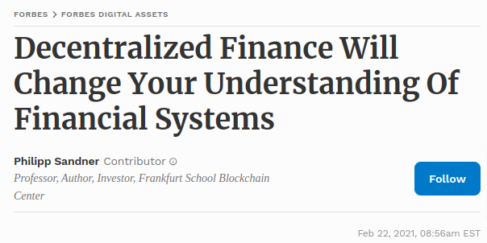

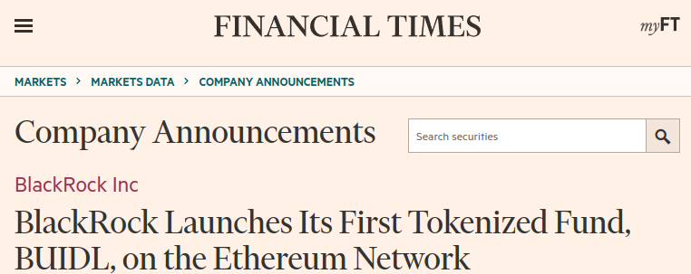

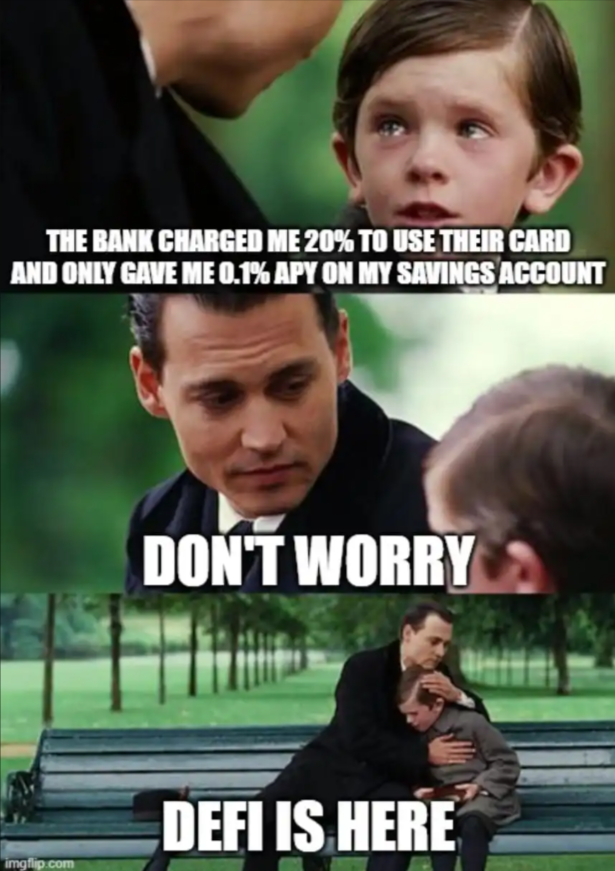

---

# Uniswap DEX

- Trading von Kryptoassets ($2.8b 24h Volume)
- Keine Finanzintermediäre (wie Handel, Clearing, Settlement, Custody)
- Global zugänglich für alle
- 365/7/24 in Betrieb
- Volle Transparenz
- https://app.uniswap.org

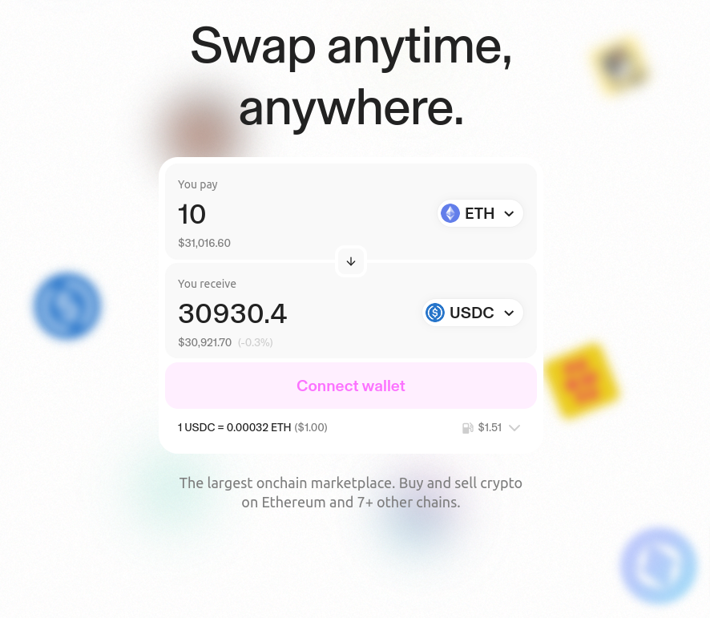

---

# Was ist DeFi?

> [...] Gemeinsam ist DeFi-Projekten insbesondere, dass sie __zugangsoffene Blockchain-Infrastrukturen__ wie Ethereum oder Solana verwenden, um __Finanztransaktionen__ weitestgehend automatisiert und __ohne Beteiligung traditioneller Finanzintermediäre__ abzuwickeln. [...] Die Nutzung steht in der Regel allen offen.

<!-- footer: '_Quelle: [FINMA](https://www.finma.ch/de/dokumentation/dossier/dossier-fintech/decentralized-finance-defi-2022/)_' -->

---

# Wie funktioniert DeFi?

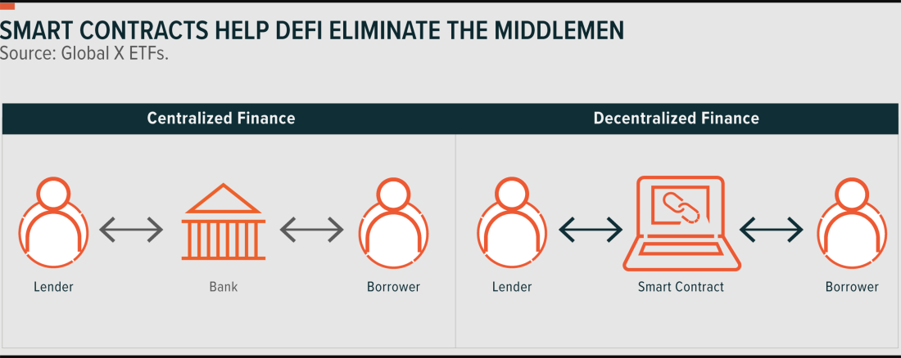

<!-- footer: '_Source: [NASDAQ](https://www.nasdaq.com/articles/defi%3A-the-basics)_' -->

---

# Was ist ein Smart Contract?

- Ein Computerprogramm, das auf der Blockchain läuft
- Definiert Daten (Zustand) und Regeln zum Ändern der Daten (Funktionen)
- Daten und Funktionen sind unter einer bestimmten Blockchain Adresse "abrufbar"
- Benutzer übermitteln "Transaktionen" auf der Blockchain, um mit den Funktionen des Smart Contract's zu interagieren
- Integrität (Daten und Funktionen) ist über die Blockchain gewahrt
- Volle Transparenz [Etherscan](https://etherscan.io), [Ethviewer](http://ethviewer.live/)

<!-- footer: "" -->

---

# Miss-verständnisse

- Smart Contracts sind nicht "smarter" als andere Computerprogramme
- Falls vorgesehen, können Daten und Logik eines Smart Contract's geändert werden

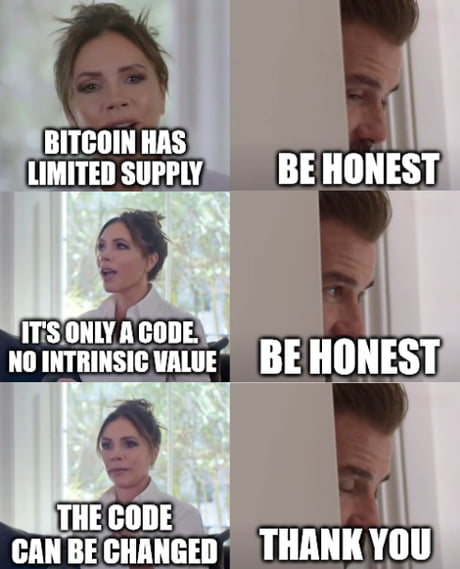

---

# DeFi Markt

 
 

| __3110__ Projekte    | __$192b__ TVL       |
| -------------------- | ------------------- |
| __$30b__ Volume (7d) | __$160m__ Fees (7d) |

<!-- footer: '_Quelle: [Defillama](https://defillama.com)  (May 2024)_' -->

---

# DeFi Markt im Vergleich

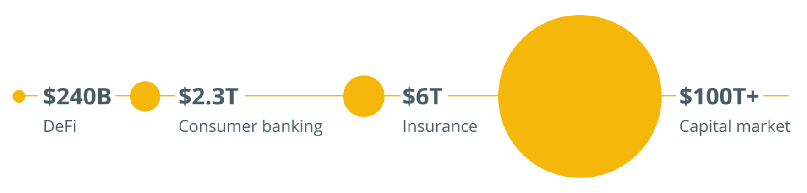

<!-- footer: '_Quelle: [Cointelegraph](https://cointelegraph.com/news/defi-can-be-100-times-larger-than-today-in-5-years) (2021)_' -->

---

# DeFi Geschichte

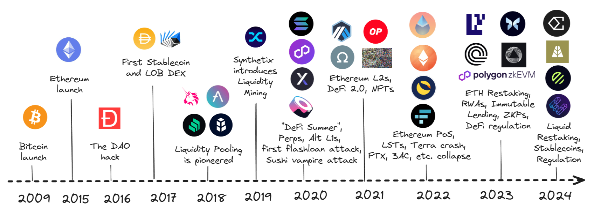

<!-- footer: "" -->

---

# DeFi Ökosystem (nach TVL)

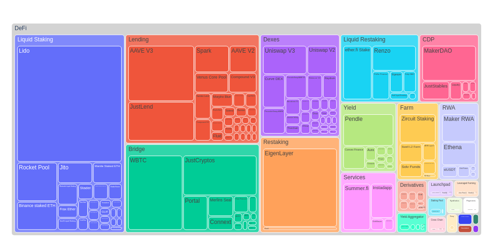

<!-- footer: '_Quelle: [Ultrasound Labs](https://ultrasound-labs.github.com/defi-ecosystem-map)_' -->

---

# Differenzierung

|                     | Traditional Finance | DeFi              |
| ------------------- | ------------------- | ----------------- |
| Custody          | Service Provider  | Nutzer                |
| Unit of account  | Fiat Währung      | Kryptocurrency      |
| Execution        | Service Provider  | Smart Contract  |
| Settlement       | 3-5 business days | Sekunden bis Minuten (365/7/25) |
| Clearing         | Clearinghouse     | Blockchain      | 
| Governance       | Service Provider  | Keine oder Community |  
| Auditierbarkeit  | Autorisierte Service Provider | Öffentlich |

<!-- footer: "" -->

---

# Vorteile

- Settlement: von 3d zu <1h
- Transaktionskosten: sub-Cent für internationale Zahlung
- Effizienz und Automation: 24/7/365
- Innovation: neue Geschäftsmodelle, Finanz-primitive (flash loans), etc

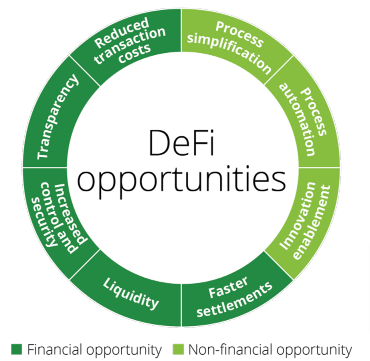

<!-- footer: '_Quelle: [Deloite](https://www2.deloitte.com/content/dam/Deloitte/us/Documents/risk/us-financial-advisory-defi-march-2022.pdf)_' -->

---

# Risiken

- Technologie: immer noch relativ jung
- Security: Phishing, Fraud, DNS hijacking, etc
- Legal: unsicherheit bzgl Regulation auch als Nutzer
- Markt, Liquidität, Gegenpartei

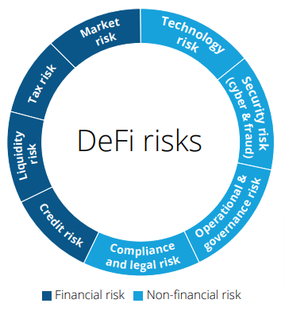

<!-- footer: "" -->

---

<!-- footer: "" -->