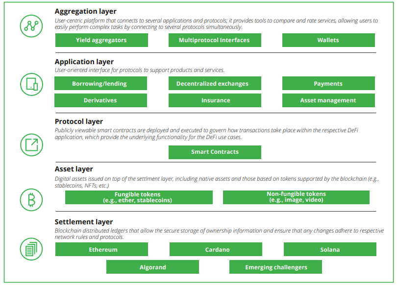

<!-- _class: lead -->

# <!--fit--> Einführung in DeFi

Weiterbildungskurs - Teil 1

https://github.com/nbundi/defi-kurs

<!-- This is presenter note. You can write down notes through HTML comment. -->

---

# DeFi ist hier

---

# Uniswap DEX

* https://app.uniswap.org
* Trading von Kryptoassets
* Keine Finanzintermediäre (wie Handel, Clearing, Settlement, Custody)
* Global zugänglich für alle
* 365/7/24 in Betrieb

---

# Was ist DeFi?

> [...] Gemeinsam ist DeFi-Projekten insbesondere, dass sie __zugangsoffene Blockchain-Infrastrukturen__ wie Ethereum oder Solana verwenden, um __Finanztransaktionen__ weitestgehend automatisiert und __ohne Beteiligung traditioneller Finanzintermediäre__ abzuwickeln. [...] Die Nutzung steht in der Regel allen offen.

_Quelle: [FINMA](https://www.finma.ch/de/dokumentation/dossier/dossier-fintech/decentralized-finance-defi-2022/)_

---

# Was ist DeFi? (cont.)

_Source: [NASDAQ](https://www.nasdaq.com/articles/defi%3A-the-basics)_

---

# Was ist ein Smart Contract?

- Ein Computerprogramm, das auf der Blockchain läuft
- Definiert Daten (Zustand) und Regeln zum Ändern der Daten (Funktionen)
- Daten und Funktionen sind unter einer bestimmten Blockchain Adresse "abrufbar"
- Benutzer übermitteln "Transaktionen" auf der Blockchain, um mit den Funktionen des Smart Contract's zu interagieren
- Integrität (Daten und Funktionen) ist über die Blockchain gewahrt
- Ethereum Demo: [Etherscan](https://etherscan.io), [Ethviewer](http://ethviewer.live/)

---

# Miss-verständnisse

- Smart Contracts sind nicht "smarter" als andere Computerprogramme
- Falls vorgesehen, können Daten und Logik eines Smart Contract's geändert werden

---

# DeFi Markt

 

| __3110__ Projekte    | __$192b__ TVL       |
| -------------------- | ------------------- |
| __$30b__ Volume (7d) | __$160m__ Fees (7d) |

_Quelle: [Defillama](https://defillama.com)  (May 2024)_

---

# DeFi Markt (cont.)

_Source: [Cointelegraph](https://cointelegraph.com/news/defi-can-be-100-times-larger-than-today-in-5-years) (2021)_

---

# DeFi Geschichte

---

# DeFi Ökosystem

_Source: [Ultrasound Labs](https://ultrasound-labs.github.com/defi-ecosystem-map)_

---

# Differenzierung

|                     | TradFi              | DeFi              |
| ------------------- | ------------------- | ----------------- |
| Custody          | Service Provider  | Nutzer                |
| Unit of account  | Fiat Währung      | Kryptocurrency      |
| Execution        | Service Provider  | Smart Contract  |
| Settlement       | 3-5 business days | Sekunden bis Minuten (365/7/25) |
| Clearing         | Clearinghouse     | Blockchain      | 
| Governance       | Service Provider  | Keine oder Community |  
| Auditierbarkeit  | Autorisierte Service Provider | Öffentlich |

---

# Vorteile

- hello

_Source: [Deloite](https://www2.deloitte.com/content/dam/Deloitte/us/Documents/risk/us-financial-advisory-defi-march-2022.pdf)_

---

# Risiken

- hello

_Source: [Deloite](https://www2.deloitte.com/content/dam/Deloitte/us/Documents/risk/us-financial-advisory-defi-march-2022.pdf)_

---

# DeFi Stack

_Source: [Deloite](https://www2.deloitte.com/content/dam/Deloitte/us/Documents/risk/us-financial-advisory-defi-march-2022.pdf) nach [Schär](https://doi.org/10.20955/r.103.153-74)_

---

---

# Links

- [Defillama](https://defillama.com)
- [Messari DeFi Screener](https://messari.io/screener/screen/defi-assets-d8ww)
- [Brief History of DeFi](https://blog.makerdao.com/a-brief-history-of-decentralized-finance-defi/) (MakerDAO blog)
