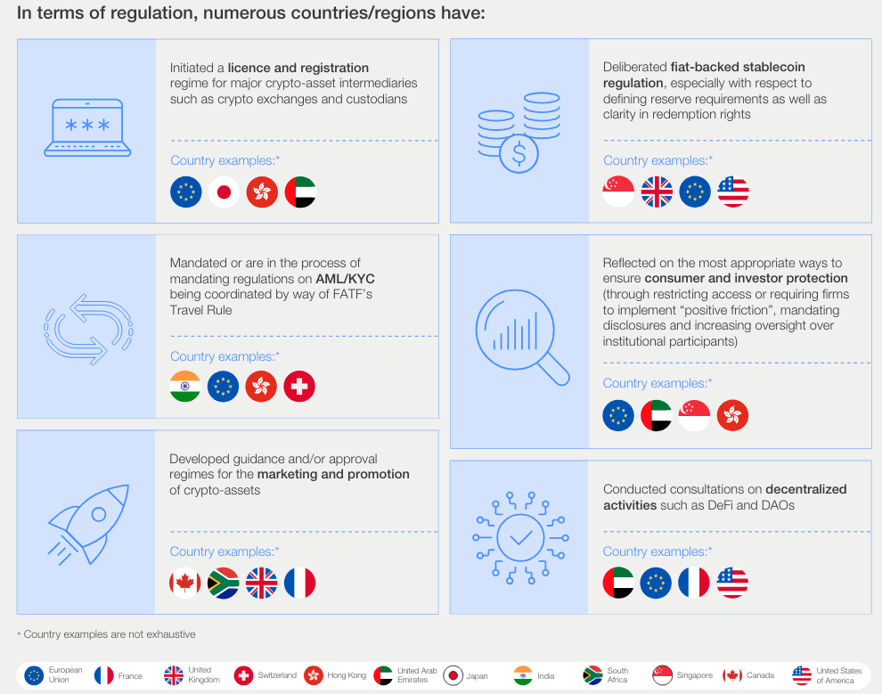

<!-- _class: lead -->

# <!--fit--> Infrastruktur und Services

## Weiterbildungskurs DeFi

### Dr. Nils Bundi

<!-- This is presenter note. You can write down notes through HTML comment. -->

---

# DeFi Infrastruktur Übersicht

---

# Blockchain Nodes

- Blockchain ist ein verteiltes Computer-Netzwerk, sog. _Nodes_
- Auf jeder Node läuft die _Client_ Software, welche die Regeln der Blockchain implementiert
- Verfügbarkeit verschiedener Client Implementationen macht das Netzwerk robuster
- Der Betrieb solcher Nodes kann anspruchsvoll sein
- Spezialisierte Infrastruktur-Firmen bieten das als Service an

---

# RPC Provider

- Blockchain und Smart Contract Daten können auf Blockchain Nodes abgefragt werden
- RPC Provider bieten API Schnittstellen an, um diese Daten ohne den Betrieb eigener Nodes abfragen zu können
- Zusätzlich können Transaktionen zur Blockchain "relayed" werden
- Transaktionen werden durch den Nutzer "signiert" und können vom RPC Provider nicht geändert werden
- Jedoch können Transaktionen "ausgeschlossen" werden, indem sie nicht zur Blockchain "relayed" werden (__Zensur__)

---

# Block Explorers

- Bereiten Blockchain Daten, finalisiert und "pending", auf
- Geben ein Bild des Zustands der Blockchain und aller Daten
- Ermöglichen die Interaktion mit Smart Contracts
- Erlauben es, auch ohne Verfügbarkeit einer DeFi App, das Produkt zu nutzen (no _lock in_)
- Beispiel: [blockchain.com](https://www.blockchain.com/explorer),  [etherscan.io](https://etherscan.io)

---

# Data Indexer

- Oft ist eine strukturierte Sicht auf Blockchain Daten für (off-chain) DeFi Apps notwendig
    - Was ist der momentane Zins in einem Lending Protokoll?
    - Was ist mein verbleibende Schuld?
    - etc.
- Indexer bieten eine ETL (Extract-Transform-Load) Infrastruktur für Blockchain Daten an
- Strukturierte Daten in Echtzeit
- Basis für viele DeFi Apps

---

# Web3 SDKs

- Software Development Kits für die effiziente Entwicklung von (DeFi) Apps
- Vereinfachen Interaktionen mit der Blockchain
    - Abfragen von Daten
    - Erstellen von Transaktionen
    - Signieren von Transaktionen durch Wallet
    - Senden von RPC "Requests"
- In verschiedenen Software Sprachen verfügbar

---

# Web Browsers

- DeFi Apps sind meist als Web-Applikationen umgesetzt
- Entwickler stellen die App mittels einer public Domäne bereit
- Nutzer verwenden die App, um mit Smart Contracts zu interagieren
- __Fragen:__ 
    - Entspricht das Bereitstellen einer (non-custodial) Website zur Interaktion mit Smart Contracts einer regulierten Tätigkeit?
    - Ist neue Regulation notwendig?
    -> Siehe nächster Teil

---

# Other Services

- Fiat On- Off-Ramps: Transfer / Wechsel von Fiat Währungen in Kryptoassets und umgekehrt
- Software Auditing: DeFi Apps managen Milliarden von USD, ein Bug bspw. im Smart Contract Code kann fatal sein
    - Exploits [Rekt Leaderboard](https://rekt.news/leaderboard/), [Defillama](https://defillama.com/hacks)
- Bug Bounties: Platform auf welcher "Whitehats" (Hacker mit guten Absichten) Bugs reporten können und dafür bezahlt werden
- Rechtsberatung / Anwaltskanzleien: DeFi ist eine junge Industrie, viele Konzepte sind neu und die Rechtslage unsicher

---

<!-- _class: lead -->

# <!--fit--> DeFi Regulation

## Weiterbildungskurs DeFi

### Dr. Nils Bundi

<!-- This is presenter note. You can write down notes through HTML comment. -->

---

# Illicit Krypto Transaktionen

<!-- footer: '_Quelle: [Chainalysis](https://www.chainalysis.com/blog/2024-crypto-crime-report-introduction/)_' -->

---

# DeFi Hacks (USD hacked pro Monat)

<!-- footer: '_Quelle: [Defillama](https://defillama.com/hacks)_' -->

---

# Regulation Bitte

- Staaten arbeiten an Regulatorien um Kryptoassets und DeFi
- Bspw.: _Markets in Crypto-Assets Regulation_ (EU)

<!-- footer: '_Quelle: [WEF](https://www.weforum.org/agenda/2024/05/global-cryptocurrency-regulations-changing/)_' -->

---

# Herausforderungen

- Wie sind Kryptoassets zu klassifizieren?
- Wer ist für die Regulation von Kryptoassets zuständig?
- Was ist DeFi und wie unterscheidet es sich von traditionellen Finanzintermediären?
- Sind neue Gesetze notwendig oder genügen die existierenden?
- Wie können wir das Potential von technologischen Entwicklungen dennoch ausschöpfen? 
- Lesenswert: [Schuler et al](https://doi.org/10.1093/jfr/fjad014) _(On DeFi and On-Chain CeFi: How (Not) to Regulate Decentralized Finance)_

<!-- footer: "" -->

---

# Schweiz: GwG und Krypto?

<!-- footer: '_Quelle: [Lexr](https://www.lexr.com) (Stand 03/2024)_' -->

---

# Schweiz: BankG und Krypto?

<!-- footer: '_Quelle: [Lexr](https://www.lexr.com) (Stand 03/2024)_' -->

---

# Schweiz: DeFi Regulierung?

<!-- footer: '_Quelle: [Lexr](https://www.lexr.com) (Stand 03/2024)_' -->

---

# EU: MiCA

 
 
 
 
 
 
 
 

__But:__ _“where crypto-asset services [...] provided in a fully decentra-lised manner [...] should not fall within the scope of this Regulation”_

<!-- footer: '_Quelle: [Hansen](https://paddihansen.substack.com/p/the-eus-mica-framework)_' -->

---

# DeFi vs DINO

- Was ist "fully" decentralized?
-  **D**ecentralized **I**n **N**ame **O**nly: DeFi mit zentraler Kontrolle (Intermediär)
- Qualifizierung des Begriffs "decentralized" schwierig
- Hier ein Versuch [DeFi Collective](https://deficollective.org/defi-protocol-guidelines)

<!-- footer: "" -->

---

---

# Fall Tornado Cash (NL)

- Smart Contract basierter "Mixer" / Privacy Tool
- Kein (direkter) Intermediär
- Aber: Team betreibt (zentralisierte) Web-App
- [Urteil](https://www.wired.com/story/tornado-cash-developer-found-guilty-of-laundering-crypto): >5 Jahre Gefägnis wegen Geldwäsche

<!-- footer: '_Quelle: [Zhao, Cui](https://link.springer.com/chapter/10.1007/978-981-16-9229-1_2)_' -->