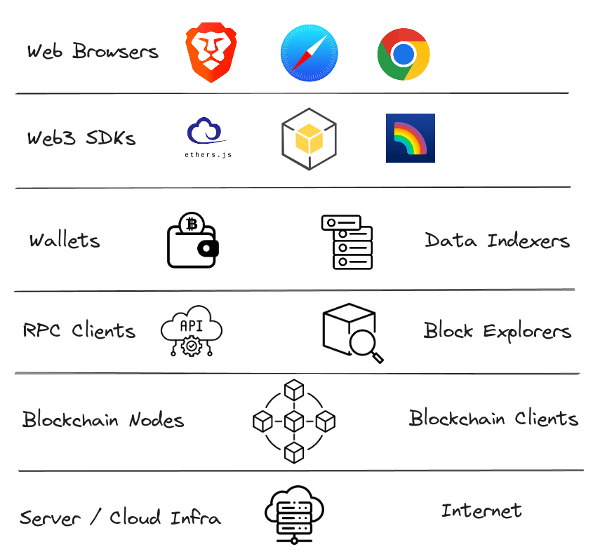

<!-- _class: lead -->

# <!--fit--> Infrastruktur und Services

Weiterbildungskurs - Teil 5

https://github.com/nbundi/defi-kurs

<!-- This is presenter note. You can write down notes through HTML comment. -->

---

# DeFi Infrastruktur

---

# Blockchain Nodes

- Blockchain ist ein verteiltes Computer-Netzwerk, sog. _Nodes_
- Auf jeder Node läuft die _Client_ Software, welche die Regeln der Blockchain implementiert
- Verfügbarkeit verschiedener Client Implementationen macht das Netzwerk robuster
- Der Betrieb solcher Nodes kann anspruchsvoll sein
- Spezialisierte Infrastruktur-Firmen bieten das als Service an

---

# RPC Provider

- Blockchain und Smart Contract Daten können auf Blockchain Nodes abgefragt werden
- RPC Provider bieten API Schnittstellen an, um diese Daten ohne den Betrieb eigener Nodes abfragen zu können
- Zusätzlich können Transaktionen zur Blockchain "relayed" werden
- Transaktionen werden durch den Nutzer "signiert" und können vom RPC Provider nicht geändert werden
- Jedoch können Transaktionen "ausgeschlossen" werden, indem sie nicht zur Blockchain "relayed" werden (__Zensur__)

---

# Block Explorers

- Bereiten Blockchain Daten, finalisiert und "pending", auf
- Geben ein Bild des Zustands der Blockchain und aller Daten
- Ermöglichen die Interaktion mit Smart Contracts
- Erlauben es, auch ohne Verfügbarkeit einer DeFi App, das Produkt zu nutzen (no _lock in_)
- Beispiel: [blockchain.com](https://www.blockchain.com/explorer),  [etherscan.io](https://etherscan.io)

---

# Wallets und Custody

Siehe [Teil 3](./defi-wallets.md)

---

# Data Indexer

- Oft ist eine strukturierte Sicht auf Blockchain Daten für (off-chain) DeFi Apps notwendig
    - Was ist der momentane Zins in einem Lending Protokoll?
    - Was ist mein verbleibende Schuld?
    - etc.
- Indexer bieten eine ETL (Extract-Transform-Load) Infrastruktur für Blockchain Daten an
- Strukturierte Daten in Echtzeit
- Basis für viele DeFi Apps

---

# Web3 SDKs

- Software Development Kits für die effiziente Entwicklung von (DeFi) Apps
- Vereinfachen Interaktionen mit der Blockchain
    - Abfragen von Daten
    - Erstellen von Transaktionen
    - Signieren von Transaktionen durch Wallet
    - Senden von RPC "Requests"
- In verschiedenen Software Sprachen verfügbar

---

# Web Browsers

- DeFi Apps sind meist als Web-Applikationen umgesetzt
- Entwickler stellen die App mittels einer public Domäne bereit
- Nutzer verwenden die App, um mit Smart Contracts zu interagieren
- __Fragen:__ 
    - Entspricht das Bereitstellen einer (non-custodial) Website zur Interaktion mit Smart Contracts einer regulierten Tätigkeit?
    - Sind neue Regularien notwendig?
    - Siehe auch das Urteil im Fall [TornadoCash](https://www.wired.com/story/tornado-cash-developer-found-guilty-of-laundering-crypto)

---

# Beispiel Tornado Cash

- Coin "Mixer" / Privacy tool
- Mittels Smart Contract
- Entwickler sind im Prozess nicht (direkt) involviert
- Aber: Betrieb von Web-App
- Strafe: +5 Jahre Gefägnis wegen Geldwäsche

_Quelle: [Zhao, Cui](https://link.springer.com/chapter/10.1007/978-981-16-9229-1_2)_

---

# Other Services

- Fiat On- Off-Ramps: Transfer / Wechsel von Fiat Währungen in Kryptoassets und umgekehrt
- Software Auditing: DeFi Apps managen Milliarden von USD, ein Bug bspw. im Smart Contract Code kann fatal sein
    - Exploits [Rekt Leaderboard](https://rekt.news/leaderboard/)
- Bug Bounties: Platform auf welcher "Whitehats" (Hacker mit guten Absichten) Bugs reporten können und dafür bezahlt werden
- Rechtsberatung / Anwaltskanzleien: DeFi ist eine junge Industrie, viele Konzepte sind neu und die Rechtslage unsicher