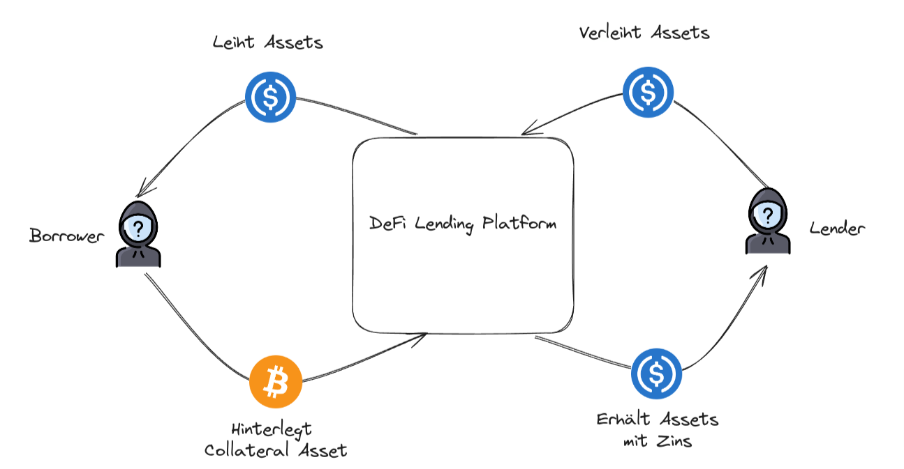
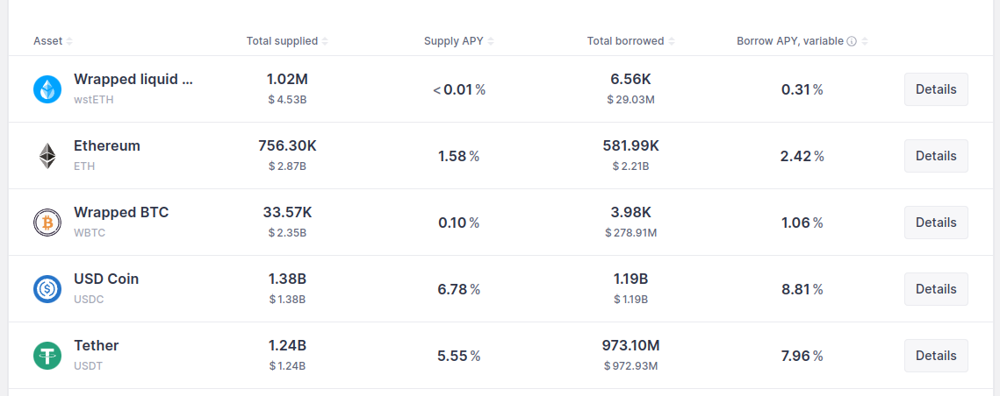
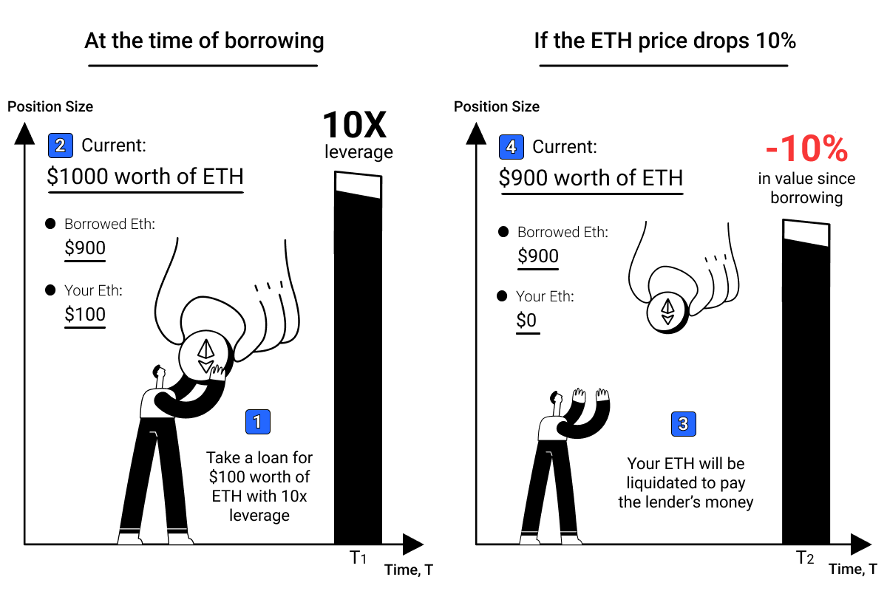
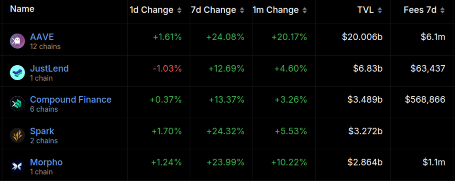

<!-- _class: lead -->

# <!--fit--> Lending und Borrowing

## Weiterbildungskurs DeFi

### Dr. Nils Bundi

<!-- This is presenter note. You can write down notes through HTML comment. -->

---

# DeFi Lending Übersicht

---

# DeFi Lending Eigenschaften

- __Blockchain:__ Umsetzung mittels Smart Contracts und Blockchain
- __Peer-to-peer:__ Kein traditioneller Intermediär
- __Global:__ Mittels öffentlicher Blockchain
- __Anonym:__ Grundsätzlich keine Information zur Gegenpartei, somit Prüfung von Kreditwürdigkeit der Gegenpartei nicht möglich
- __Besicherung__ (Collateral): Anstelle von Kreditprüfung, >100% Besicherung durch Kryptoasset
- __Liquidation:__ Teil des Lending Protokolls, Gerichtsweg nicht möglich (da anonym und global)

---

# DeFi vs. Traditional Lending

_Quelle: [Appinventiv](https://appinventiv.com/blog/how-defi-lending-works/)_

---

# Wieso Lending?

- Liquidität auf Kryptoasset
- Levered Exposure auf Kryptoasset (e.g. BTC, ETH, etc.)
- Levered Exposure auf Yield (e.g. ETH Staking) 
- Short Kryptoasset (e.g. Stablecoin depeg event)
- Airdrop "Farming"
- Finanzierung von Arbitrage und MEV Strategien
- etc.

---

# Aave Lending Märkte

<!-- footer: '_Quelle: [Aave](https://app-aave-com.ipns.dweb.link) (Mai 2024)_' -->

---

# TVL in DeFi Lending

<!-- footer: '_Quelle: [Defillama](https://defillama.com/categories) (Mai 2024)_' -->

---

# Zweitgrösster DeFi Sektor

<!-- footer: '_Source: [Ultrasound Labs](https://ultrasound-labs.github.com/defi-ecosystem-map)_' -->

---

# Lending Platform Modelle

|    |  Over-Collateralized  | Un-Collateralized  |
| -- | --------------------- | ------------------ |
| Anonym        | Ja   | Nein (Borrower) |
| Kreditprüfung | Nein | Ja, durch _Pool Manager_ |
| Besicherung   | >100% mittels Kryptoassets | Nein | 
| Liquidation   | On-chain | Auf Gerichtsweg |

<!-- footer: "" -->

---

# Lending Platform Modelle (cont.)

|    |  Peer-to-peer  | Peer-to-pool  |
| -- | --------------------- | ------------------ |
| Gegenpartei | Borrower | Pool |
| Liquidität   | Fragmentiert (nach individuellen Terms) | Pooled ( die gleichen terms für Teilnehmer) |
| Besicherung | Ja / Nein | Ja / Nein |
| Maturität | Fixed (pro Loan) | Variabel |
| Zins | Fixed (pro Loan) | Variabel |

---

# Liquidationen

<!-- footer: '_Quelle: [Etherscan](https://info.etherscan.com/explanation-on-defi-liquidation/)_' -->

---

# Loan-to-Value Ratio

Das _Loan-to-Value Ratio_ (LTV) ist ein zentraler Faktor, der die _Solvenz_ einer Schuld-Position auf einer Lending Platform abbildet:

$$
LTV = \frac{\text{Wert der Schuld}}{\text{Wert der Besicherung}}
$$

Position kann liquidiert werden, sobald eine definierte Grenze, das $MaxLTV$, überschritten wird:

$$
LTV \geq MaxLTV \rightarrow \text{liquidieren}
$$

<!-- footer: "" -->

---

# Liquidatoren

- Grundsätzlich offen (jeder kann liquidieren)
- Liquidator macht Profit
- Sehr kompetitiver Markt dominiert durch MEV-bots
- Verschiedene Modelle (folgende Folie)

<!-- footer: '_Quelle: [Qin et al](https://dl.acm.org/doi/10.1145/3487552.3487811)_' -->

---

# Preis Oracles

<!-- footer: '_Quelle: [Chainlink](https://chain.link/use-cases/defi)_' -->

---

# Liquidations-Modelle

<!-- footer: '_Quelle: [Delphi Digital](https://members.delphidigital.io/reports/breaking-down-the-design-space-of-money-market-liquidations)_' -->

---

# Liquidationen auf Aave

<!-- footer: '_Quelle: [Block Analitica](https://aave.blockanalitica.com) (Mai 2024)_' -->

---

# Flash Loans

<!-- footer: '_Quelle: [LearnWeb3](https://learnweb3.io/lessons/borrow-millions-without-collateral-from-aave-using-flash-loans/)_' -->

---

# Anwendungen von Flash Loans

- Arbitrage
- Liquidation
- Leverage
- Position Management (e.g. Collateral Swap)
- UX

<!-- footer: "" -->

---

# Top Lending Platformen

<!-- footer: '_Quelle: [Defillama](https://defillama.com) (Mai 2024)_' -->