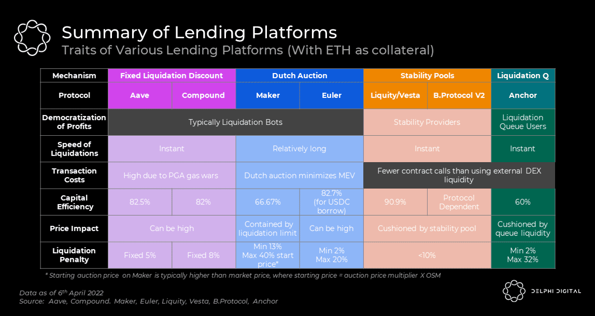

<!-- _class: lead -->

# <!--fit--> DeFi Lending - An Introduction

## DeFi Talents Guest Lecture
### 4. November 2024
### Dr. Nils Bundi

<!-- This is presenter note. You can write down notes through HTML comment. -->

---

### Dr. Nils Bundi

 
 

 Founder [Vesu Lending](https://vesu.xyz)
 President [DeFi Collective](https://deficollective.org)
 Lecturer [ZHAW School of Engineering](https://zhaw.ch)

---

# What if?

- I could earn on my crypto
- I could borrow crypto
- Directly from my wallet
- Only requiring an internet connection
- __Anonymously__
- __Globally__

---

# TVL in DeFi Lending

<!-- footer: '_Source: [Defillama](https://defillama.com/categories)_' -->

---

# One of the largest DeFi sektors

<!-- footer: '_Source: [Ultrasound Labs](https://ultrasound-labs.github.com/defi-ecosystem-map)_' -->

---

# But, how?

<!-- footer: "" -->

---

# Position health

__Loan-to-value__ (LTV) measures value of debt vs collateral

$$
LTV = \frac{\text{Value of Debt}}{\text{Value of Collateral}}
$$

__Health factor__ (HF) measures liquidation risk

$$
HF = \frac{\text{LiquidationLTV}}{\text{LTV}}
$$

__Liquidate__ position if HF<1!

<!-- footer: "" -->

---

# Liquidations

---

# In practice

<!-- footer: '_Source: [Block Analitica](https://aave.blockanalitica.com) (Mai 2024)_' -->

---

# Liquidation models

<!-- footer: '_Source: [Delphi Digital](https://members.delphidigital.io/reports/breaking-down-the-design-space-of-money-market-liquidations)_' -->

---

# Liquidators

- Public (everyone can be a liquidator)
- Liquidators make profit
- Highly competitive market dominated by MEV-bots
- Capital-neutral liquidations use flash-loans

<!-- footer: '_Source: [Qin et al](https://dl.acm.org/doi/10.1145/3487552.3487811)_' -->

---

# Flash Loans

- Borrow any amount without collateral
- __BUT:__ repay in same tx
- __IF NOT:__ entire tx reverts
- Zero counterparty risk
- Used for liquidations, arbitrage, leverage, position management (eg collateral swap, UX)

<!-- footer: '_Source: [LearnWeb3](https://learnweb3.io/lessons/borrow-millions-without-collateral-from-aave-using-flash-loans/)_' -->

---

# Interest rates

- What is the cost of borrowing?
- Mostly variable based on market's utilization
- Mostly involves active DAO/Operator decisions
- __State-of-the-art:__ adaptive model with autonomous _Curve Controller_

<!-- footer: '_Source: [www.docs.vesu.xyz](https://docs.vesu.xyz/blog/2024-04-03-vesu-lending-hooks)_' -->

---

# Vesu Lending Markets

<!-- footer: '_Source: [www.vesu.xyz](https://vesu.xyz)_' -->

---

# TradFi vs DeFi

<!-- footer: '_Source: [Appinventiv](https://appinventiv.com/blog/how-defi-lending-works/)_' -->

---

# Lending recap

|               |  Bank                | DeFi                | DeFi Flash Loan   |
| ------------- | -------------------- | ------------------- | ----------------- |
| Counterparty  | Bank                 | Smart Contract      | Smart Contract    |
| Collateral    | <100%                | >100%               | No                |
| KYC           | Yes                  | No                  | No                |
| Interest      | Fix/variable         | Fix/variable        | Fix fee           |
| Maturity      | Fixed                | Open                | 1 Block           |
| Liquidation   | Through courts       | On-chain            | No need           |
| Access        | Local (Jurisd.)      | Global              | Global            |
| Service hrs   | Business hrs/days    | 24/7/365            | 24/7/365          |

<!-- footer: "" -->

---

# Thank you!

 

 [@nilsbundi](https://twitter.com/nilsbundi)  
 [Nils Bundi](https://ch.linkedin.com/in/nils-bundi-6246b998)  
 [@nbundi](https://github.com/nbundi)  

