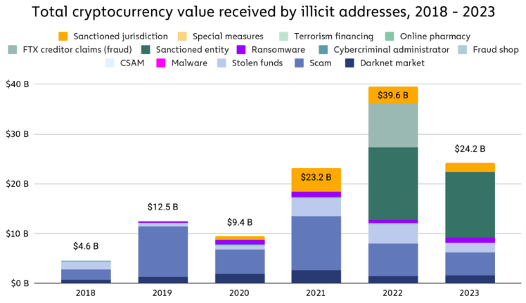
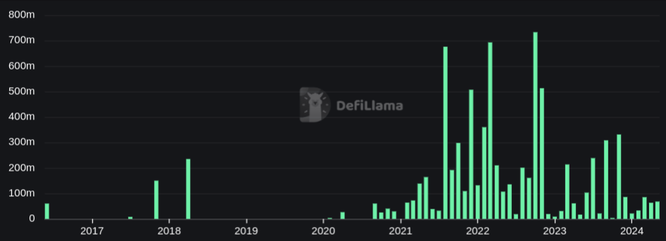
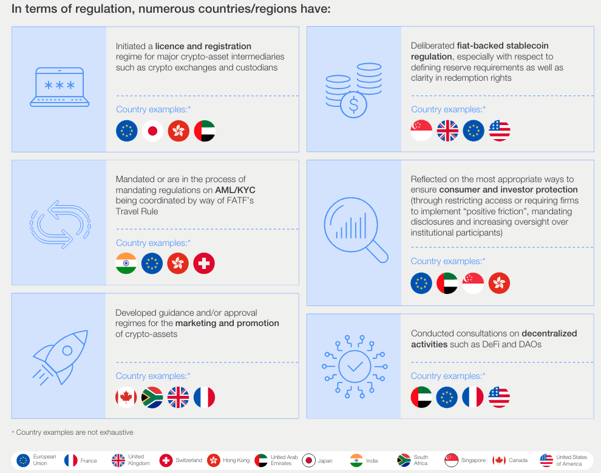
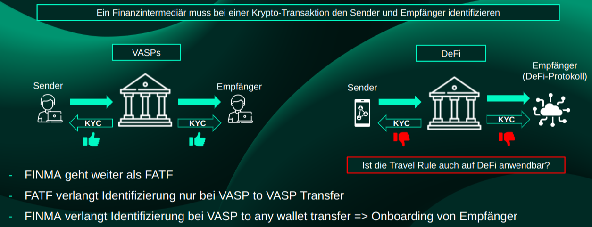
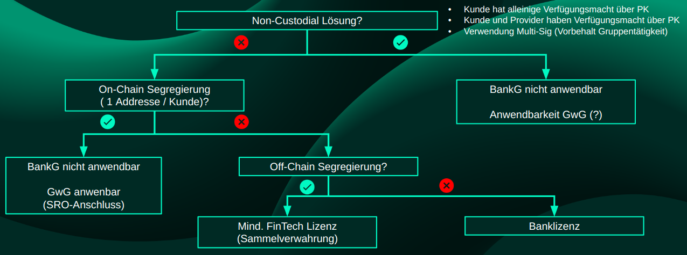
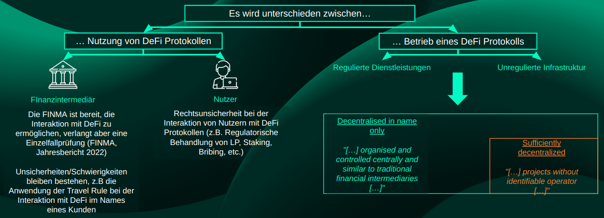
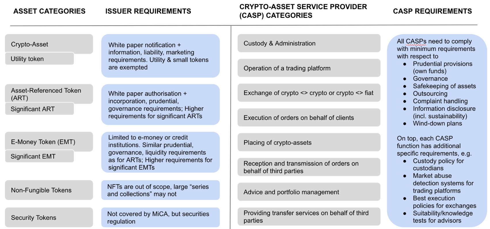
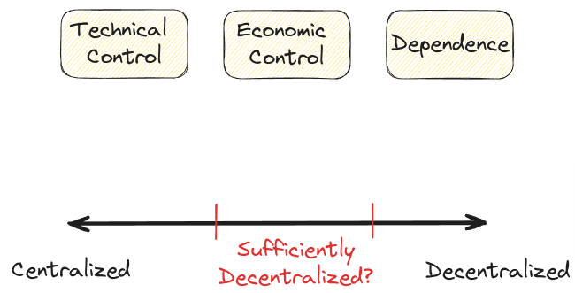
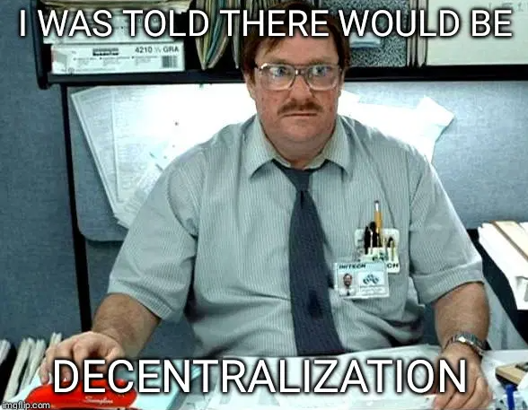
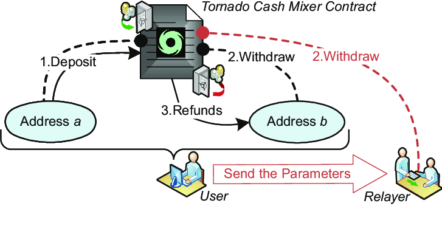

<!-- _class: lead -->

# <!--fit--> DeFi Regulation

Weiterbildungskurs - Teil 6

https://github.com/nbundi/defi-kurs

<!-- This is presenter note. You can write down notes through HTML comment. -->

---

# Illicit Krypto Transaktionen

_Quelle: [Chainalysis](https://www.chainalysis.com/blog/2024-crypto-crime-report-introduction/)_

---

# DeFi Hacks (USD hacked pro Monat)

_Quelle: [Defillama](https://defillama.com/hacks)_

---

# Regulation Bitte

- Staaten arbeiten an Regulatorien um Kryptoassets und DeFi
- Bspw.: _Markets in Crypto-Assets Regulation_ (EU)

_Quelle: [WEF](https://www.weforum.org/agenda/2024/05/global-cryptocurrency-regulations-changing/)_

---

# Herausforderungen

- Wie sind Kryptoassets zu klassifizieren?
- Wer ist für die Regulation von Kryptoassets zuständig?
- Was ist DeFi und wie unterscheidet es sich von traditionellen Finanzintermediären?
- Sind neue Gesetze notwendig oder genügen die existierenden?
- Wie können wir das Potential von technologischen Entwicklungen dennoch ausschöpfen? 
- Lesenswert: [Schuler et al](https://doi.org/10.1093/jfr/fjad014) _(On DeFi and On-Chain CeFi: How (Not) to Regulate Decentralized Finance)_

---

# Schweiz: GwG und Krypto?

_Quelle: [Lexr](https://www.lexr.com) (Stand 03/2024)_

---

# Schweiz: BankG und Krypto?

_Quelle: [Lexr](https://www.lexr.com) (Stand 03/2024)_

---

# Schweiz: DeFi Regulierung?

_Quelle: [Lexr](https://www.lexr.com) (Stand 03/2024)_

---

# EU: MiCA

 
 
 
 
 
 
 
 

__But:__ _“[...] provided in a fully decentralised manner [...] should not fall within the scope of this Regulation”_
_Quelle: [Hansen](https://paddihansen.substack.com/p/the-eus-mica-framework)_

---

# DeFi vs DINO

- **D**ecentralized **I**n **N**ame **O**nly: DeFi mit zentraler Kontrolle (Intermediär)
- Qualifizierung des Begriffs "Decentralized" ist schwierig
- Hier ein Versuch [DeFi Collective](https://deficollective.org/defi-protocol-guidelines)

---

---

# Fall Tornado Cash (NL)

- Smart Contract basierter "Mixer" / Privacy Tool
- Kein (direkter) Intermediär
- Aber: Team betreibt (zentralisierte) Web-App
- [Urteil](https://www.wired.com/story/tornado-cash-developer-found-guilty-of-laundering-crypto): >5 Jahre Gefägnis wegen Geldwäsche

<!-- footer: '_Quelle: [Zhao, Cui](https://link.springer.com/chapter/10.1007/978-981-16-9229-1_2)_' -->