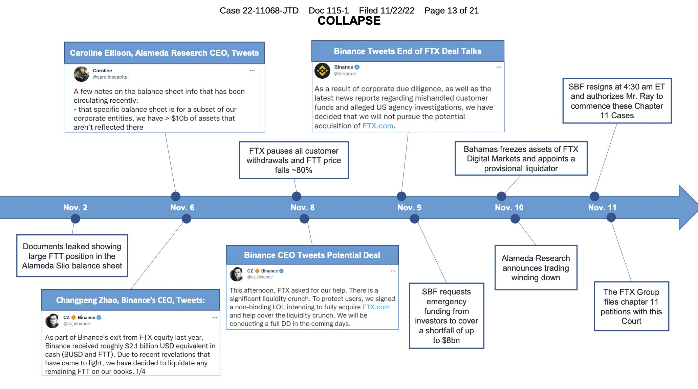
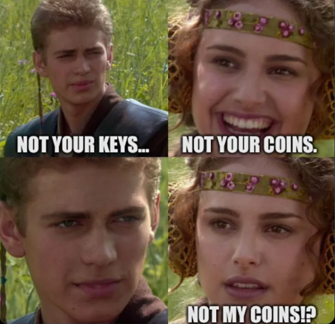

<!-- _class: lead -->

# <!--fit--> Custody und Wallets

Weiterbildungskurs - Teil 3

https://github.com/nbundi/defi-kurs

<!-- This is presenter note. You can write down notes through HTML comment. -->

---

# Krypto Custody

- Blockchain Konten bestehen aus einem öffentlichen und privaten Schlüssen (Public / Private Key Pair)
- Kryptoassets werden mittels solcher Konten verwahrt
- Transaktionen werden mittels dem Private Key bestätigt
- Custody von Kryptoassets beschäftigt sich mit der (sicheren) Aufbewahrung des Private Key's
- __Achtung:__ Wiederherstellung des Private Key's, bspw. bei Verlust, ist nicht möglich!

---

# Custodial vs. Non-Custodial Wallets

|                    | Custodial | Non-Custodial |
| :----------------- | :-------- | :------------ |
| Verantwortlichkeit | Drittpartei verwahrt den PK | Nutzer verwahrt den PK |
| Sicherheit         | Abhängig vom Verwahrer | Abhängig vom Nutzer (und Wallet) |
| Wiederherstellung  | Durch Verwahrer | Abhängig vom Wallet |
| Kompatibilität | Meist nicht DeFi kompatibel | DeFi kompatibel |

---

# FTX Exchange Kollaps

---

---

# Arten von Wallets

_Quelle: [Bitpanda](https://www.bitpanda.com/academy/de/lektionen/was-ist-eine-wallet-und-wo-bekomme-ich-eine/)

---

# Beispiel [Argent](https://argent.xyz)

